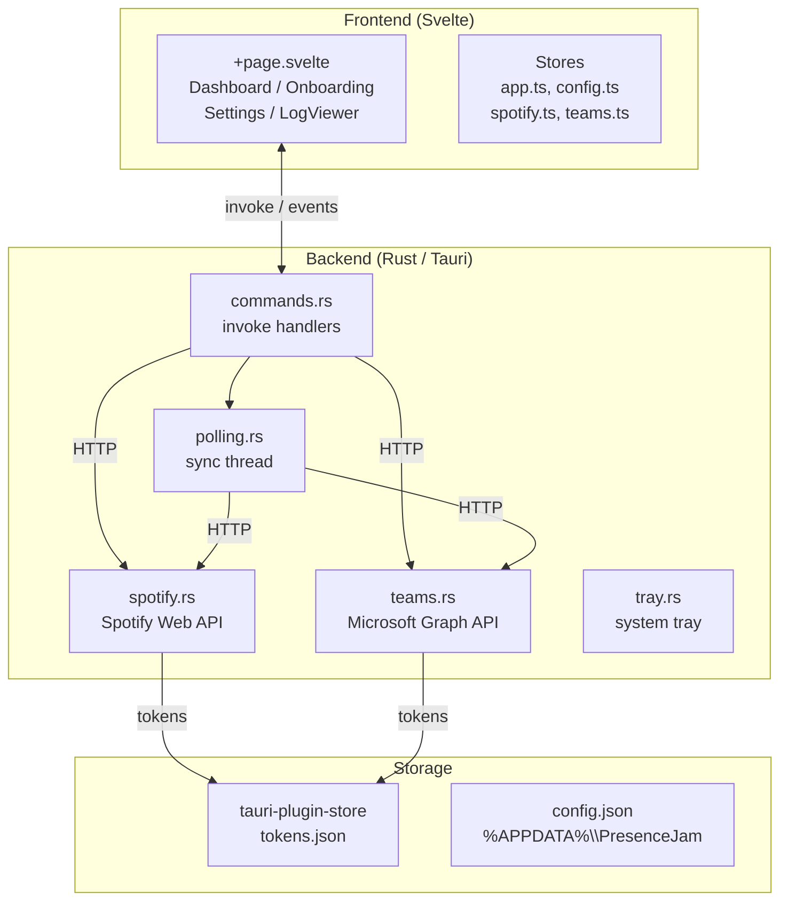
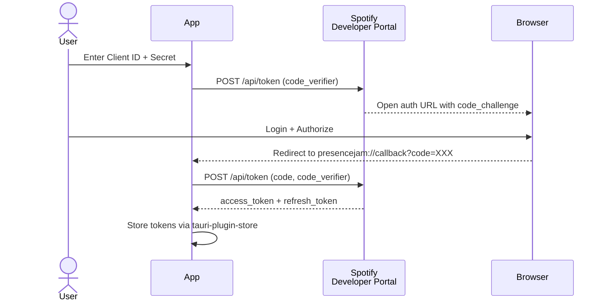
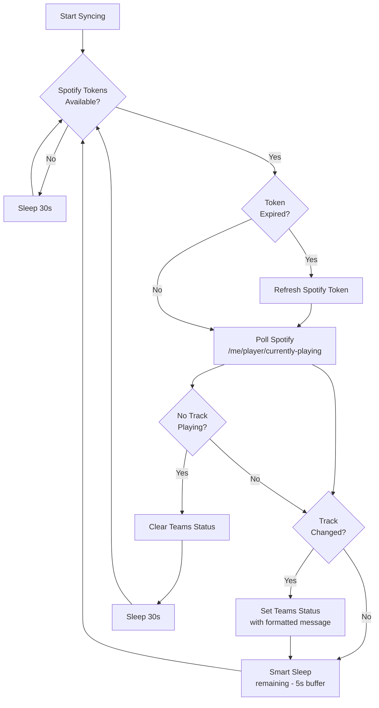
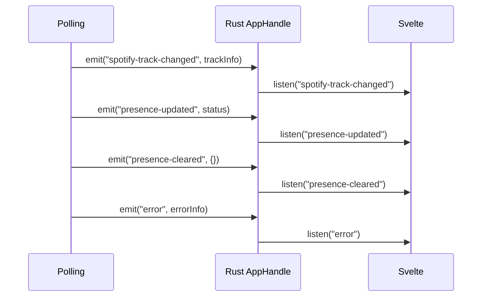

# Architecture

A deep-dive into how PresenceJam works under the hood.

## Overview

PresenceJam is a Tauri 2 desktop application with:

- **Frontend:** Svelte 5 + TypeScript (SPA mode via `@sveltejs/adapter-static`)
- **Backend:** Rust (Tauri 2 command handlers + polling thread)
- **Storage:** `tauri-plugin-store` for tokens, JSON files for config
- **Auth:** Spotify PKCE OAuth 2.0 + Microsoft Teams Device Code flow
- **Platform:** Windows-first (single-instance enforcement, system tray, DPAPI token encryption)

## System Diagram



## Authentication Flows

### Spotify PKCE OAuth



1. App generates a PKCE `code_verifier` (random 64-byte string)
2. App sends `code_challenge` (SHA256 hash of verifier) to Spotify
3. Spotify returns an auth URL → App opens browser
4. User authorizes → Spotify redirects to `presencejam://callback?code=XXX`
5. App extracts the `code`, sends it + `code_verifier` to Spotify
6. Spotify returns `access_token` + `refresh_token` → stored via `tauri-plugin-store`

### Microsoft Teams Device Code Flow


The app polls Microsoft's token endpoint every 5 seconds while the user completes the browser auth. Once authorized, tokens are stored and the status message is set via Graph API.

## Polling Loop



### Smart Sleep Logic

When a track is playing, the app calculates the exact time remaining until the track ends:

```rust
let remaining_ms = track.duration_ms - track.progress_ms;
let buffer_ms = 5000u64; // 5 second buffer
let sleep_secs = (remaining_ms / 1000).saturating_sub(buffer_ms / 1000);
sleep_secs.max(MINIMUM_INTERVAL_SECONDS).min(MAX_INTERVAL_SECONDS)
```

This means:
- **No API calls** while you're listening to a 4-minute track (~240 seconds of silence)
- **Polling resumes immediately** when the track changes
- **Minimum 10 seconds** between polls (configurable)

## Event Bus

The Rust backend communicates with the Svelte frontend via Tauri events:



| Event | Payload | Triggered When |
|-------|---------|---------------|
| `spotify-track-changed` | `TrackInfo` | New track detected or track state changed |
| `presence-updated` | `{status, timestamp}` | Teams status successfully updated |
| `presence-cleared` | `{timestamp}` | Teams status cleared |
| `error` | `{source, message}` | Any API error (Spotify, Teams, or auth) |
| `tray-click` | — | User clicks tray icon |
| `toggle-pause` | — | User clicks Pause in tray menu |

## Deep Link Routing

PresenceJam registers a custom URL scheme to handle OAuth callbacks:

| Scheme | Used For |
|--------|----------|
| `presencejam://callback` | Spotify PKCE OAuth redirect |
| `presencejam://teams-callback` | Teams auth (reserved for future use) |

The app's `lib.rs` intercepts these URLs via Tauri's `deep-link` plugin and routes them to the appropriate handler.

## Directory Structure

```
PresenceJam-Desktop/
├── src/                          # Svelte frontend
│   ├── lib/
│   │   ├── components/
│   │   │   ├── Dashboard.svelte      # Main sync view
│   │   │   ├── Onboarding.svelte     # 3-step auth wizard
│   │   │   ├── Settings.svelte        # Config editor
│   │   │   └── LogViewer.svelte       # In-app log viewer
│   │   └── stores/
│   │       ├── app.ts                 # currentView, isSyncing, appError
│   │       ├── config.ts               # configStore, saveConfig
│   │       ├── spotify.ts              # Spotify token state
│   │       └── teams.ts                # Teams token state
│   └── routes/
│       └── +page.svelte               # SPA entry, routes to views
├── src-tauri/
│   ├── src/
│   │   ├── lib.rs                     # Tauri entry, command registration
│   │   ├── commands.rs               # All invoke() command handlers
│   │   ├── config.rs                 # JSON config load/save, AppConfig struct
│   │   ├── polling.rs                # Polling loop (thread::spawn)
│   │   ├── spotify.rs                # Spotify Web API client
│   │   ├── teams.rs                  # Microsoft Graph API client
│   │   └── tray.rs                   # System tray setup
│   ├── Cargo.toml                    # Rust dependencies
│   ├── tauri.conf.json               # Tauri 2 config (window, deep-link, plugins)
│   └── capabilities/
│       └── default.json              # Permission grants (store, http, deep-link, etc.)
├── package.json                     # Node dependencies
├── svelte.config.js                # SvelteKit SPA config (adapter-static)
├── vite.config.js                  # Vite/Tauri dev server config
└── tsconfig.json                   # TypeScript config
```

## State Management

### Rust State (`AppState`)

```rust
pub struct AppState {
    pub spotify_tokens: RwLock<Option<SpotifyTokens>>,
    pub teams_tokens: RwLock<Option<TeamsTokens>>,
    pub config: RwLock<Option<AppConfig>>,
    pub current_track: RwLock<Option<TrackInfo>>,
    pub is_syncing: RwLock<bool>,
}
```

Multiple threads access this shared state via `RwLock`:
- `polling.rs` thread writes to `spotify_tokens`, `teams_tokens`, `current_track`, `is_syncing`
- `commands.rs` handlers read/write via `tauri::State<AppState>`

### Frontend Stores

| Store | Type | Purpose |
|-------|------|---------|
| `currentView` | `'onboarding' \| 'dashboard' \| 'settings' \| 'logs'` | Active view |
| `isSyncing` | `boolean` | Sync running/paused |
| `appError` | `string \| null` | Current error message |
| `currentTrack` | `TrackInfo \| null` | Currently playing track |
| `configStore` | `AppConfig` | Full app config |
