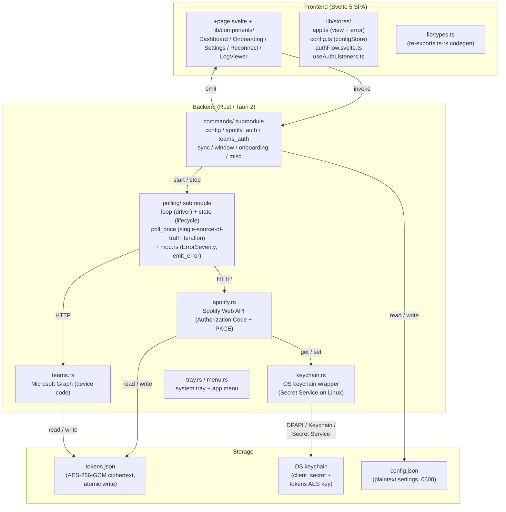
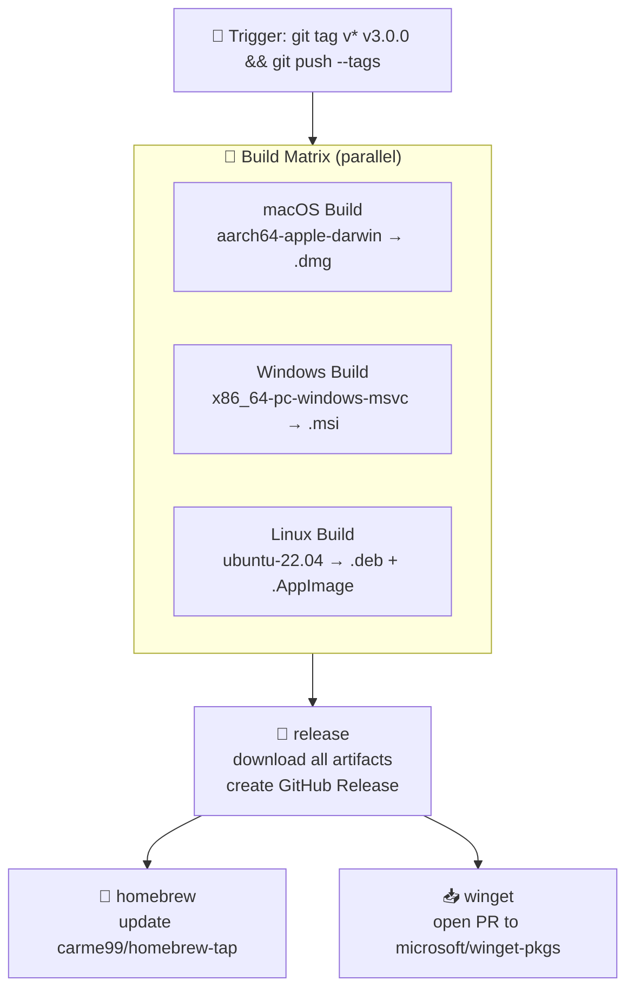
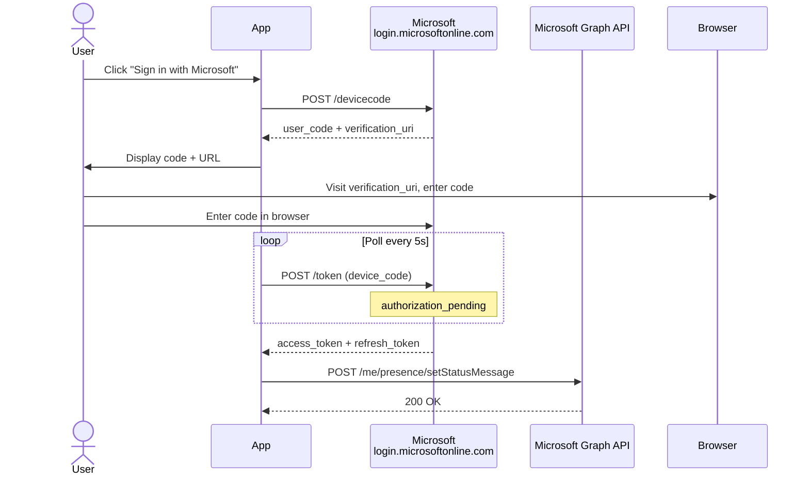
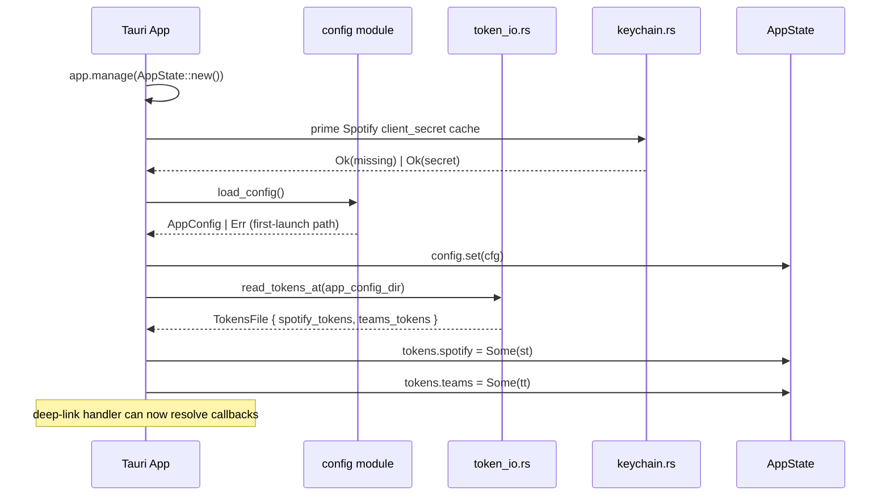
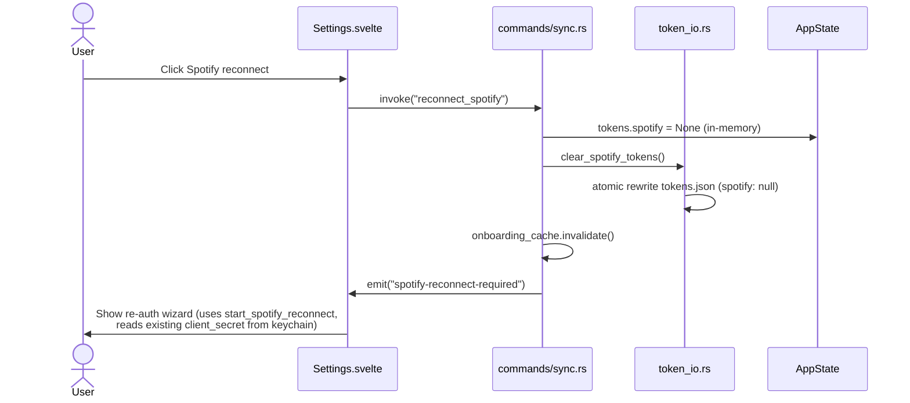
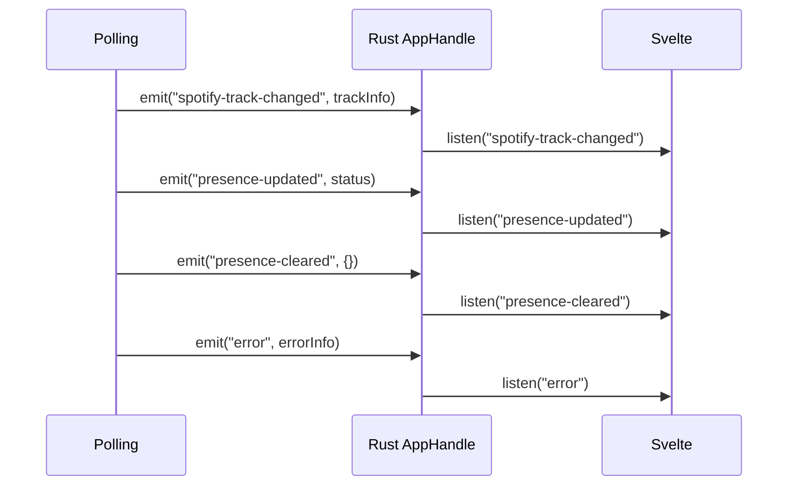

# Architecture

A deep-dive into how PresenceJam works under the hood.

## Overview

PresenceJam is a Tauri 2 desktop application:

- **Frontend:** Svelte 5 + TypeScript (SPA via `@sveltejs/adapter-static`),
  wired to a strict Rust contract via `ts-rs` build-time codegen (see
  *Directory Structure* below).
- **Backend:** Rust — Tauri 2 `#[tauri::command]` handlers in the
  `commands/` submodule tree, plus a single `polling/` driver that
  handles all Spotify/Teams sync work.
- **Storage (atomic, no tauri-plugin-store):** `tauri-plugin-store` is
  registered in `lib.rs` for capability reasons but **never invoked** at
  runtime — all persistence goes through two hand-written atomic-write
  modules instead:
  - `config.rs::save_config()` → `atomic_write_json()` → temp-file + rename
    + fsync to `%APPDATA%\PresenceJam\config.json` (Linux/macOS path
    variants handled by `dirs`).
  - `token_io.rs::persist_tokens()` → temp-file + rename + fsync to
    `<app-config-dir>/PresenceJam/tokens.json` for OAuth tokens. Since
    v3.0 (issue #140) the file is **AES-256-GCM ciphertext**, never
    plaintext JSON: `b"PJENC" | version byte (0x01) | 12-byte random
    nonce | ciphertext`, with the 256-bit key held in the OS keychain
    under `tokens_aes_key:com.presencejam.app`. Plaintext files from
    ≤ v2.10.0 are migrated to ciphertext on first read. `config.json`
    stays plaintext JSON (mode 0600; it holds no credentials).
  Both paths survive process-kill mid-write (see issue #65; see `SECURITY.md`).
- **Auth:** Spotify Authorization Code + PKCE OAuth (confidential client) +
  Microsoft Teams Device Code flow.
- **Secrets — TWO PATHS, both intentional** (do not conflate):
  - **Spotify `client_secret`** is in the OS keychain, namespaced per
    installation — DPAPI on Windows, Keychain on macOS, Secret Service
    on Linux (gnome-keyring or kwallet). See [SETUP.md#linux-keyring](SETUP.md#linux-keyring).
    A working OS keychain is a hard dependency; there is no on-disk
    encrypted fallback (issue #9).
  - **OAuth access/refresh tokens** (Spotify + Teams) live in
    `tokens.json` written atomically by `token_io.rs` — **AES-256-GCM
    ciphertext at rest** (issue #140), decryption key in the OS keychain
    under `tokens_aes_key:com.presencejam.app`. The webview has
    no path to read them (closed issue #65).
- **Platform:** Windows + macOS + Linux. Single-instance enforcement,
  system tray, `presencejam://` deep-link scheme re-registered on every
  launch (see *Deep Link Routing*).

## System Diagram



## CI/CD Pipeline

Releases are automated via GitHub Actions on every `v*.*.*` tag push. Three jobs
fire in parallel; three downstream jobs (`release`, `homebrew`, `winget`) sequence
off them:



### Release Process

1. **Tag push:** Maintainer runs `git tag vX.Y.Z && git push --tags`.
2. **Parallel matrix:** macOS, Windows, and Linux builds run concurrently on
   GitHub's hosted runners (Linux .deb + .AppImage added in v2.7.0 via PR #94).
3. **Artifact upload:** Each OS build uploads its Tauri-bundled artifact via
   `actions/upload-artifact` (v7 in v2.8.0; v4 in 2.7.x).
4. **Release:** The `release` job downloads all artifacts and creates the
   GitHub Release via `ncipollo/release-action`.
5. **Updater manifest (v3.0):** the same `release` job hand-assembles
   `latest.json` — per-platform URLs + minisign `.sig` contents + `pub_date`
   — and uploads it to the release (`gh release upload`). The updater's
   configured endpoint resolves it via `releases/latest/download/latest.json`.
6. **Distribution:** `homebrew` and `winget` jobs (each consuming the GitHub
   Release artifact) update the tap / open a winget-pkgs PR in parallel.

The full workflow: [`.github/workflows/release.yml`](.github/workflows/release.yml).
The PR-time CI that gates merges is [`.github/workflows/ci.yml`](.github/workflows/ci.yml).

## Auto-Update (v3.0)

Updates are delivered through `tauri-plugin-updater` (registered in
`lib.rs`; `updater:default` in `capabilities/default.json`). The endpoint
(`tauri.conf.json`) is
`https://github.com/Carme99/PresenceJam-Desktop/releases/latest/download/latest.json`
— a hand-assembled manifest (`release.yml`) mapping each platform to its
signed artifact on the GitHub Release:

- `darwin-aarch64` → `PresenceJam-<tag>.app.tar.gz` (+ `.sig`)
- `windows-x86_64` → `PresenceJam-<tag>.msi` (+ `.msi.sig`)
- `linux-x86_64` → `PresenceJam-linux-amd64.AppImage` (+ `.AppImage.sig`)

`latest.json` carries the minisign `signature` (the `.sig` file
*content*, not a path), `version` (tag without the leading `v`), and
`pub_date`. The build matrix signs artifacts via the
`TAURI_SIGNING_PRIVATE_KEY` / `_PASSWORD` secrets; the app's updater
pubkey is inlined in `tauri.conf.json`, so the plugin rejects tampered
payloads.

**Flow:** `UpdatePrompt.svelte` calls `check()` on startup → if a newer
version exists it shows a dismissible **"Update vX.Y.Z available"** banner
→ **Download & Install** runs `downloadAndInstall()` with a progress
readout → `invoke("relaunch_app")` (`commands/misc.rs::relaunch_app`,
`AppHandle::restart`) restarts the process into the new version. A failed
check (offline, unreachable endpoint, signature mismatch) is silent —
never blocks the UI.

Payload signing is independent of OS code signing: the updater works on
unsigned builds, and the macOS unsigned/Gatekeeper story (README
"macOS first-run note") applies to updated `.app` builds too. The release
matrix builds **aarch64 macOS only** — Intel Macs never receive updates
(known gap, see `docs/3.0-release-research.md`).

## Authentication Flows

### Spotify OAuth (Authorization Code + PKCE, confidential client)

```mermaid
sequenceDiagram
    actor User
    participant App as PresenceJam
    participant Spotify as Spotify<br/>accounts.spotify.com
    participant Browser

    User->>App: Enter Client ID + Secret (Settings)
    App->>App: store client_secret in OS keychain<br/>(per-install namespaced slot)
    App->>App: generate PKCE code_verifier (64 random bytes)
    App->>App: compute code_challenge = SHA256(verifier)
    App->>App: build auth URL, open in system browser
    Note over App,Spotify: redirect_uri = `presencejam://callback`<br/>(Spotify requires byte-exact match;<br/>no per-launch scheme UUID possible)
    User->>Browser: Login + Authorize
    Browser-->>App: Deep-link callback `presencejam://callback?code=…&state=…`
    App->>Spotify: POST /api/token (grant_type=authorization_code,<br/>code, code_verifier, client_id)<br/>+ Authorization: Basic &lt;client_id:client_secret&gt;
    Spotify-->>App: access_token + refresh_token
    App->>Spotify: POST /api/token (grant_type=refresh_token,<br/>refresh_token)<br/>+ Authorization: Basic &lt;client_id:client_secret&gt;
    Spotify-->>App: new access_token + refresh_token
    App->>App: persist tokens to tokens.json (atomic write)
```

**Notes:**

- The flow is a **hybrid**: the authorize leg is genuine PKCE (S256), and the
  token-exchange and refresh legs also authenticate with the client secret via
  `Authorization: Basic <client_id:client_secret>`. That matches neither
  Spotify flow exactly — it's the PKCE-tutorial request body plus the
  Authorization Code flow's Basic header (a strict superset of both; RFC 7636
  §5 keeps PKCE params additive, so this is a documented combination). A
  confidential client — one that can securely store a secret — is expected to
  use it (Spotify's Feb-2025 "Increasing the security requirements" post).
- The `state` parameter is the CSRF token **and** the per-launch anti-hijack
  binding — Spotify echoes it back verbatim, so we can encode extra entropy in
  it without registering anything new with Spotify. See *Deep Link Routing* for
  the matching server-side check.
- The `client_secret` round-trip from settings → keychain happens once during
  initial onboarding; subsequent token refreshes read it back from the cache.
  See `keychain.rs` and issue #9.
- The OS keychain / Secret Service write happens via `keychain.rs`; failure to
  reach a working keychain surfaces a user-actionable error pointing at
  [SETUP.md#linux-keyring](SETUP.md#linux-keyring).

### Microsoft Teams Device Code Flow



The app polls Microsoft's token endpoint every 5 seconds while the user completes the browser auth. Once authorized, tokens are stored and the status message is set via Graph API.

### Teams Presence APIs (v3.0)

The Graph **presence** surface (`setPresence` / `clearPresence` /
`getPresence`) is v1.0, delegated via the Teams scope string
`Presence.ReadWrite Presence.Read profile offline_access` (`teams.rs`) —
`Presence.Read` powers the status gate, `profile` adds the `oid` claim to
the access-token JWT. All three endpoints hit `graph.microsoft.com/v1.0`,
and `sessionId` is always the app's Azure AD client id
(`MICROSOFT_GRAPH_CLIENT_ID`) — the stable per-app session key.

- **`set_teams_presence(availability, activity, expiration_duration)`** —
  `POST /me/presence/setPresence` first, falling back to
  `POST /users/{oid}/presence/setPresence` on 404 (the docs document only
  `/users/{id}`). The object id comes from the `oid` claim of the Teams
  access-token JWT (`teams.rs::graph_oid_from_access_token`), which is
  present once `profile` is in the scope string. Only five
  availability/activity combinations are valid; PresenceJam uses
  `Available`/`Available` (expiration `PT4H`) for availability sync.
- **`clear_teams_presence()`** — `POST /me/presence/clearPresence`, same
  `/users/{oid}` fallback; a 404 on either path is documented success (the
  session is already gone).
- **`get_teams_presence()`** — `GET /me/presence`, parsed
  case-insensitively into `PresenceInfo { availability, activity }`
  (the docs enumerate lowercase values; real responses are PascalCase).
  Powers the status gate (issue #3.0-P2) and availability re-arm timing.

Rate limits: getPresence 1,500 req/30 s/app/tenant; presence writes
10,000 req/30 s/app/tenant — the polling loop's cadences sit far inside
both. The entire presence surface is unsupported in the China (21Vianet)
national cloud (see `docs/STATE-OF-FEATURES.md`).

## Startup Loading

On app launch, PresenceJam loads persisted config and tokens into `AppState`:



This means:
- **First launch:** no tokens on disk, onboarding prompts are shown.
- **Subsequent launches:** tokens atomically re-read by `token_io.rs`, OAuth-tokens
  never re-enter `tauri-plugin-store` (issue #65 closed that path).
- **After a Spotify mid-OAuth crash:** pending auth *state* is no longer persisted to disk at all — the user restarts the OAuth flow. Crash-safe: PKCE verifier (a 10-min bearer credential) is in AppState only.
- **Reconnect** clears tokens from both memory and the tokens.json file on disk, forcing re-auth.

## Reconnect Flow

When the user clicks "Reconnect" in Settings, the app clears auth state for
one provider and triggers re-authentication:



### Commands

| Command | Action |
|---------|--------|
| `reconnect_spotify` | Clears Spotify tokens (in-memory + atomic rewrite of tokens.json), emits `spotify-reconnect-required` event |
| `reconnect_teams` | Clears Teams tokens (in-memory + atomic rewrite of tokens.json), emits `teams-reconnect-required` event |

## Polling Loop

The sync loop is intentionally a single thread, driven by `polling/loop.rs`
around the single-source-of-truth `polling/poll_once.rs` (refactored from
the pre-v2.7.5 monolith in PR #72 — three near-duplicate API-call branches
and 3 drift points now collapse into one). Flow:

```mermaid
flowchart TD
    Start[User clicks Start Syncing] --> Claim{Polling::try_claim}
    Claim -->|false, already on| Exit
    Claim -->|true| Loop[polling/loop.rs spawns thread]
    Loop --> Tick[polling/poll_once::run one iteration]
    Tick --> Tokens{Spotify & Teams<br/>tokens valid?}
    Tokens -->|spotify expired| RefreshSpot[refresh_spotify_token]
    Tokens -->|ok| Poll[/me/player/currently-playing]
    RefreshSpot --> Poll
    Poll --> Changed{Track changed?}
    Changed -->|No track, paused| Consec[consecutive_pauses++]
    Changed -->|yes| Format[format_status template]
    Format --> Prof[filter_profanity if enabled]
    Prof --> Set[POST /me/presence<br/>setStatusMessage]
    Set --> SmartSleep[Smart sleep until track ends - 5s]
    Consec --> Backoff[Pause-aware exponential backoff:<br/>30s → 60s → 120s → 300s cap]
    SmartSleep --> Tick
    Backoff --> Tick
```

### Smart sleep + pause-aware backoff (PR #45)

Two complementary rate-limits:
- **Smart sleep:** when a track is playing, sleep until `track.duration_ms - track.progress_ms - 5000ms`,
  clamped to the configured `min/max_interval_seconds`. Polling resumes
  immediately when the track changes. ~240 seconds of silence per 4-min track.
- **Pause-aware backoff:** after consecutive non-playing responses
  (`Ok(None)`, or a track with `is_playing == false`) the loop doubles its
  interval up to a 5-min cap (30 → 60 → 120 → 300 s). It resets only once
  a *playing* track is observed again. At the 30 s default cadence a
  fully-polled day is ~2880 calls; paused, the loop settles at 1 call per
  300 s — ~288-291 calls per 24 h (steady state 288), ~72-75 per 6 h: a
  ~10× reduction, not ~28×.

### Presence gating + availability sync (v3.0)

Two `TeamsConfig` flags shape what the polling loop writes:

- **`presence_gate` (default ON, issue #3.0-P2):** on a *track change*
  only, the loop calls `get_teams_presence` *before* the status write.
  If `availability ∈ {busy, doNotDisturb}` or
  `activity ∈ {inAMeeting, inACall, presenting}` it skips the write and
  emits `presence-gated` (the Dashboard shows a "suppressed" chip); the
  next track change re-evaluates. Writes proceed when presence is clear
  (`Available`, `Away`, …). A transient gate-read failure degrades to a
  logged warning and the write proceeds.
- **`availability_sync` (default OFF, issue #3.0-P1):** while a track
  plays, re-arm the Graph `Available`/`Available` presence session via
  `set_teams_presence` at most every 4 minutes — Available sessions
  **fade after 5 min** regardless of `expirationDuration`, so the re-arm
  cadence (`AVAILABILITY_REARM_SECONDS` = 240 s) stays strictly inside
  the fade window. On pause/stop, `clear_teams_presence` drops the
  session (404 = already gone = success). Emits
  `presence-availability-updated` on each arm/clear.

`is_syncing` ownership: `commands/sync::start_syncing` is the **sole claimer**
(v2.6.3, fixes issue #60 — `compare_exchange(false, true, …)` is here).
`polling::start_polling` is a pure thread-spawner; the panic guard + spawn-error
map-err in `polling/state.rs` resets the flag so future claims don't wedge.

### Profanity filter

`profanity.rs` screens the formatted status string before it hits Microsoft
Graph. If matched, the status is replaced with `config.teams.profanity_placeholder`
(default: `Currently Listening to Spotify`), with the `{emoji}` placeholder
resolved to 🎵 or ⏸️. The replaced status is logged at info level; the
**original profane text is never written to logs**.

Detection features (25-word curated list, see `profanity.rs`):
- **Leetspeak normalization:** `1→i, 3→e, $→s, @→a, 0→o, 5→s, 7→t, !→i, |→i`.
- **Repeated-character collapse:** `shiiit → shiit` (up to 2 excess chars).
- **Word-boundary safety:** prevents false positives on `class`, `assassin`, `cocktail`, `vacuum`.
- **Compound-word safe-suffixes:** `tail, head, hand, ...` allow `fishtail`, `forehead`, `handheld`.


## Event Bus

The Rust backend communicates with the Svelte frontend via Tauri events:



| Event | Payload | Triggered When |
|-------|---------|---------------|
| `spotify-track-changed` | `TrackInfo` | New track detected or track state changed |
| `presence-updated` | `{status, timestamp}` | Teams status successfully updated |
| `presence-cleared` | `{timestamp}` | Teams status cleared |
| `error` | `{source, message}` | Any API error (Spotify, Teams, or auth) |
| `spotify-reconnect-required` | `null` | Spotify token expired or auth failure requiring re-auth |
| `teams-reconnect-required` | `null` | Teams token expired or auth failure requiring re-auth |
| `reconnect-required` | `null` | Transient failure retry limit exhausted, polling loop exiting |
| `polling-thread-panicked` | `null` | Polling thread panicked and was caught by `catch_unwind` |
| `tray-click` | — | User clicks tray icon |
| `toggle-pause` | — | User clicks Pause in tray menu |
| `presence-gated` | `{reason}` | Status write suppressed by busy/DND/in-meeting/in-call/presenting presence (v3.0) |
| `presence-availability-updated` | `{available, label, timestamp}` | Availability session armed (`Available`) or cleared (v3.0) |
| `playback-error` | `{message}` | Tray playback command failed — no active device, non-Premium 403, etc. (v3.0) |

## Deep Link Routing

PresenceJam registers the custom URL scheme `presencejam://` (declared in
`tauri.conf.json` under `plugins.deep-link.desktop.schemes`) to handle OAuth
callbacks. The registration runs **on every launch**, not just at install:

| Scheme                          | Used For                          |
|---------------------------------|-----------------------------------|
| `presencejam://callback`        | Spotify OAuth redirect (Authorization Code + PKCE) |

### Routing flow

`lib.rs::handle_deep_link` parses the URL, matches on scheme + path, and
dispatches to `handle_spotify_callback` — the only deep-link consumer.
Teams auth uses the **device-code flow exclusively**, which needs no
redirect URI at all (and therefore no callback route). The single-instance
plugin scans the launch argv for `presencejam://…` on Windows + Linux so
opening a callback URL routes to the running instance (via the
single-instance hook) instead of spawning a second copy.

### `state` parameter is both CSRF and anti-hijack binding

Spotify echoes the OAuth `state` parameter back verbatim in the callback URL.
We piggyback two things on it:

1. **CSRF token** (random 64-byte verifier-ish) — rejected on mismatch
   in `handle_spotify_callback`, defending against cross-site initiated flows.
2. **Per-launch anti-hijack binding** — the matching verifier is also in
   `AppState::PendingSpotifyAuth.state` (in-memory only, never persisted —
   issue #65). An interceptor who steals the OAuth `code` cannot exchange it
   for tokens without the verifier, and our polling thread's verifier cache
   keeps the secret off disk.

### Per-launch scheme re-registration (further mitigates #66)

`tauri-plugin-deep-link`'s `register_all()` is invoked in the desktop
`setup` block on every launch. Behavior by platform:

- **Windows:** writes `HKCU\Software\Classes\presencejam` — last-writer
  wins. A foreign app that pre-registered the scheme gets clobbered.
- **Linux:** writes `~/.local/share/applications/presencejam.desktop` with
  `MimeType=x-scheme-handler/presencejam;` and runs `xdg-mime default`.
  Same last-writer semantics.
- **macOS:** the plugin's `register` returns `Err(UnsupportedPlatform)`.
  App logs a warning at startup and continues. macOS coverage relies on
  PKCE + `state`-only protection (no LaunchServices call). The full
  `LSSetDefaultHandlerForURLScheme` native-FFI work for macOS is tracked
  separately.

On a `name` mismatch (an attacker pre-registers before launch), the
local-machine registry / desktop file reflects our (last-write) entry.
A foreign app already installed before PresenceJam at the **same OS
user** can still win the race on platforms without per-launch
reregistration — that's the macOS gap. Windows + Linux are now covered.

## Directory Structure

```
PresenceJam-Desktop/
├── src/                                   # Svelte 5 frontend (SPA)
│   ├── lib/
│   │   ├── components/
│   │   │   ├── Dashboard.svelte            # Sync status + currently-playing card
│   │   │   ├── Onboarding.svelte           # 3-step OAuth wizard
│   │   │   ├── Settings.svelte             # Config editor
│   │   │   ├── Reconnect.svelte            # Re-auth flow
│   │   │   ├── UpdatePrompt.svelte         # Auto-update banner (check → download → relaunch, v3.0)
│   │   │   ├── About.svelte                # Version + license
│   │   │   └── LogViewer.svelte            # In-app log viewer
│   │   ├── stores/
│   │   │   ├── app.ts                      # currentView, appError (classic writable stores)
│   │   │   ├── config.ts                   # configStore + saveConfig
│   │   │   └── authFlow.svelte.ts          # 4-event auth-listener state
│   │   ├── types.ts                        # Re-exports ts-rs codegen
│   │   ├── types-generated/                # ts-rs output (gitignored, regenerated by cargo test)
│   │   └── utils/
│   │       ├── dev.ts                      # devLog() no-op in prod builds
│   │       └── useAuthListeners.ts          # Shared 4-event listener setup
│   └── routes/
│       └── +page.svelte                    # SPA entry, routes to views
├── src-tauri/
│   ├── src/
│   │   ├── lib.rs                          # Tauri entry, command registration, AppState
│   │   ├── commands/                       # Split from commands.rs (PR #76)
│   │   │   ├── mod.rs                      #   re-exports + tests
│   │   │   ├── config.rs                   #   save_config / load_config
│   │   │   ├── spotify_auth.rs             #   start_spotify_auth / reconnect / refresh
│   │   │   ├── teams_auth.rs                #   device code + refresh
│   │   │   ├── sync.rs                     #   start_syncing / stop_syncing / get_sync_status
│   │   │   ├── window.rs                    #   show_window / autostart / logs folder
│   │   │   ├── onboarding.rs                #   is_onboarding_complete / complete / reconnect
│   │   │   ├── playback.rs                 #   playback_play / pause / next / previous / transfer + devices / queue (v3.0)
│   │   │   └── misc.rs                     #   preview_status / update_tray_menu_state / relaunch_app
│   │   ├── polling/                        # Split from polling.rs (PR #72)
│   │   │   ├── mod.rs                      #   re-exports + ErrorSeverity + emit_error
│   │   │   ├── loop.rs                     #   driver (mpsc channel, ~50 lines)
│   │   │   ├── poll_once.rs                #   single source of truth for one iteration
│   │   │   └── state.rs                    #   start_polling / stop_polling + panic guard
│   │   ├── config.rs                      # AppConfig struct, ts-rs TS derive
│   │   ├── keychain.rs                    # OS keychain wrapper, secret-service Linux
│   │   ├── token_io.rs                    # Hand-rolled atomic-write for tokens.json
│   │   ├── pkce.rs                        # PKCE verifier/challenge generation
│   │   ├── profanity.rs                   # 25-word curated profanity filter
│   │   ├── spotify.rs                      # PKCE OAuth client + Web API (ts-rs TS)
│   │   ├── teams.rs                        # Device-code + MS Graph (ts-rs TS)
│   │   ├── tray.rs                        # System tray + dedup snapshot
│   │   └── menu.rs                        # macOS / Windows app menu bar
│   ├── Cargo.toml                         # Rust deps + `ts-rs = { version = "12", features = ["chrono-impl"] }`
│   ├── Cargo.lock                         # Commit-locked for reproducible builds
│   ├── tauri.conf.json                    # Window + deep-link + bundle config
│   └── capabilities/
│       └── default.json                   # CSP, permissions, allowed APIs
├── .github/workflows/
│   ├── ci.yml                             # PR-time: cargo check/clippy/test, npm check
│   └── release.yml                        # Tag-triggered: 3-OS matrix + homebrew + winget
├── homebrew/presence-jam.rb               # Homebrew tap formula template
├── package.json                           # Node deps + scripts
├── pnpm-lock.yaml                         # (npm package-lock.json committed instead)
├── svelte.config.js                       # SvelteKit SPA config (adapter-static)
├── vite.config.js                         # Vite + Tauri dev server
└── jsconfig.json                          # TypeScript config
```

**ts-rs generated types** — `src/lib/types.ts` re-exports `SpotifyTokens`,
`TrackInfo`, `TeamsTokens`, `DeviceCodeResponse`, `SyncStatus`, and `AppConfig`
from `src/lib/types-generated/` (a build-time-only directory; .gitignored).
The Rust structs derive `#[ts_rs::TS]` with `#[ts(export, export_to =
"../../src/lib/types-generated/")]`. Renaming a Rust wire field produces a
TypeScript compile error in the consumer, not a runtime `undefined`.

## State Management

### Rust State — `AppState` (struct-of-states, v2.7.5 refactor PR #80)

`AppState` is composed of private sub-structs, each with its own lock
acquired only via a method. Field access is encapsulated; the inner mutex
/atomic is **never named at call sites**:

```rust
pub struct AppState {
    pub tokens: Tokens,                       // #80 step 2: spotify + teams RwLocks
    pub polling: Polling,                     // #80 step 2: is_syncing + handle + stop_tx
    pub pending: PendingAuths,                // #80 step 2: spotify + teams RwLocks
    pub config: Config,                       // #80 step 2: AppConfig RwLock
    pub onboarding_cache: OnboardingCache,    // #80 step 1: 30s cache sub-struct
}
```

Each sub-struct exposes only lock-acquisition methods (`tokens.spotify_mut()`,
`polling.try_claim()`, `pending.spotify_mut()`, `config.set()`, `onboarding_cache.lock()`).
The lock-encapsulation pattern is what makes future work like "lock must not be
held across await" enforceable: a `lock_async` method could replace `lock` later
without rewriting every call site.

**Lock ordering / concurrency rules:**

- `is_syncing` is owned only by `commands/sync::start_syncing::try_claim()`. The
  polling `loop` reads it under `Ordering::Acquire` and exits on `false`. The
  panic guard + spawn-error `map_err` in `polling/state.rs` **reset** it so
  future claims never wedge. Adding a second CAS to `is_syncing` from anywhere
  else (PR #60 was exactly this) will brick first-run onboarding. The
  `test_app_state_sub_encapsulation_no_pub_inner_fields` regression guard
  asserts no future contributor re-exposes a sub-struct's inner mutex as `pub`.
- **Token-refresh concurrency (PR #43):** all token-refresh paths (Spotify
  proactive, Spotify 401-retry, Teams refresh) share a CAS guard: re-read
  under the write lock, only commit if `access_token` is unchanged from
  the pre-refresh snapshot, otherwise discard. Prevents the lost-update race.
- **`onboarding_cache.lock()` (PR #47):** `parking_lot::Mutex<(Instant, bool)>`
  with a 30 s TTL — `is_onboarding_complete` calls upstream APIs only on cache
  miss. Plus `invalidate()` from every token-mutating command (issue #70).

### Frontend state

- `lib/stores/app.ts` (classic Svelte stores): `currentView`, `appError`. Pattern: `writable<View>('dashboard')`. Not Svelte 5 runes.
- `lib/stores/config.ts`: `configStore` (full AppConfig), `saveConfig` (mirrors
  `commands/save_config`'s atomic-write semantics on the Rust side; the
  frontend does not call `localStorage`).
- `lib/stores/authFlow.svelte.ts`: per-provider `isAuthenticating`,
  `lastError` derived from the 4 backend auth events (refactored from 3
  duplicated listener setups in PR #73 via `useAuthListeners`).
- `lib/types.ts` / `lib/types-generated/` — Rust-side TS mirrors, see *ts-rs
  generated types* above.

