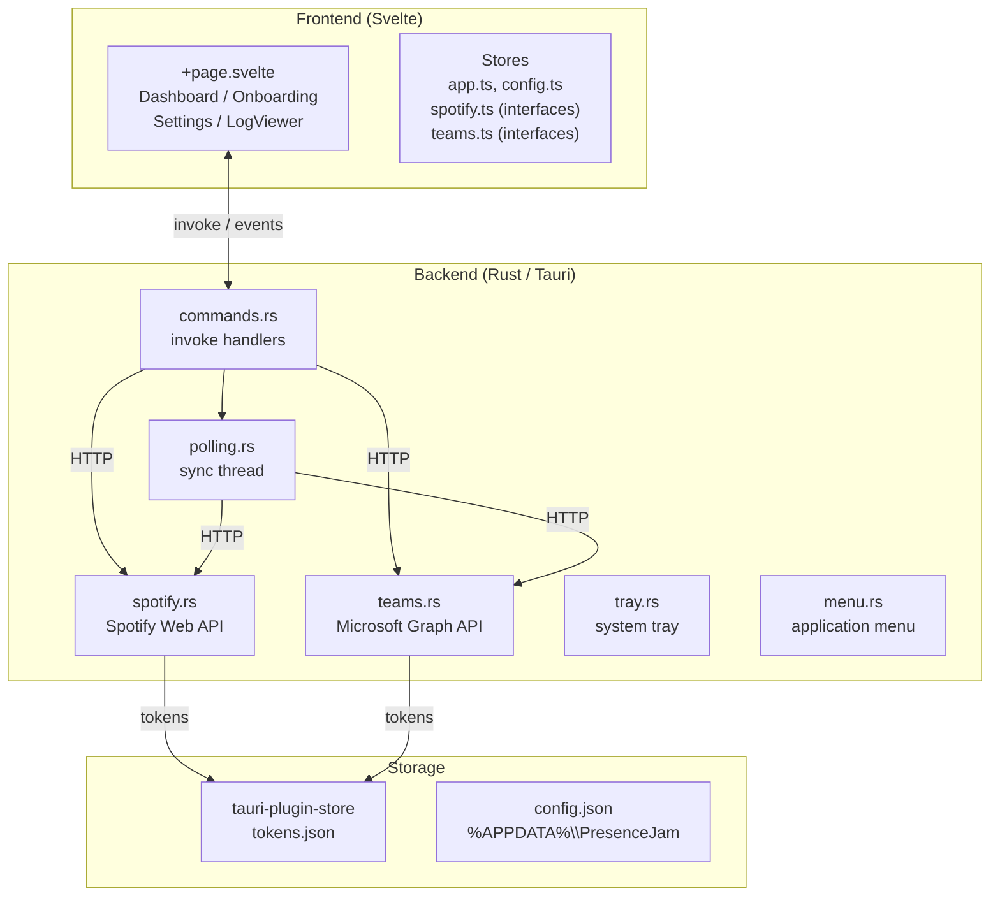
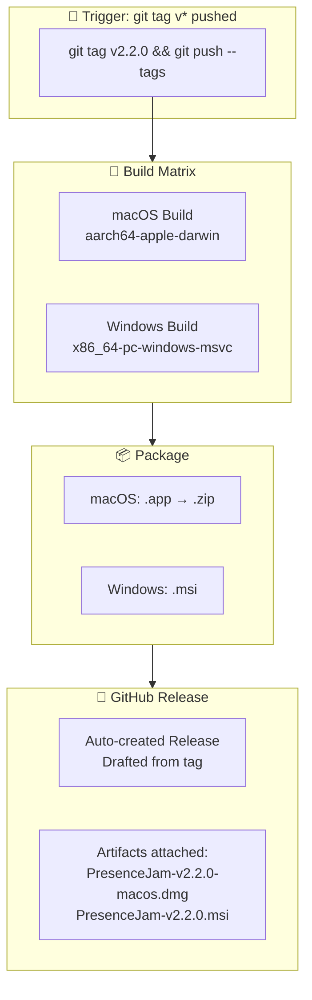
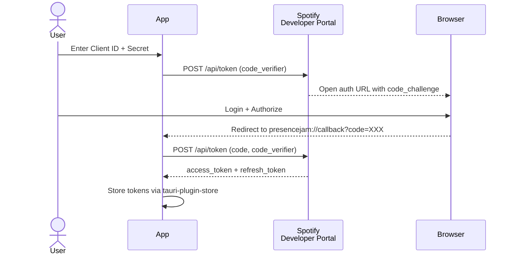
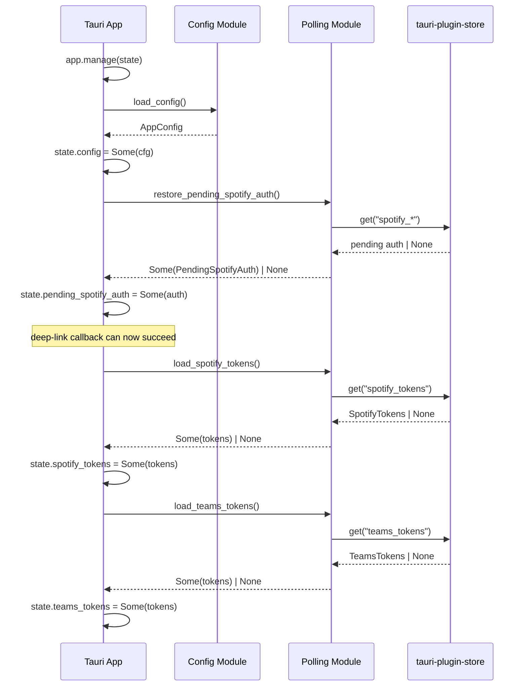
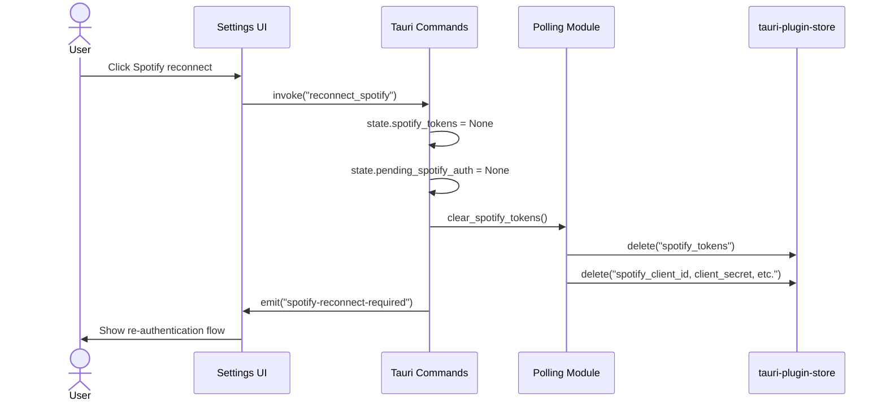
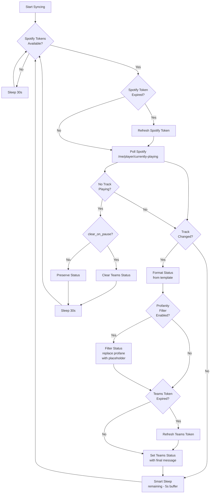
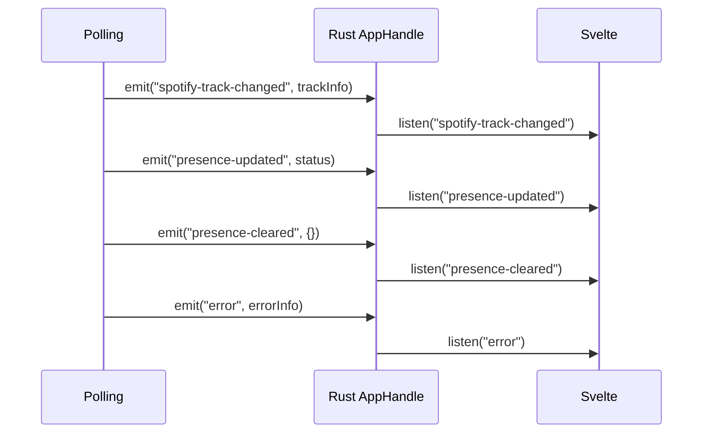

# Architecture

A deep-dive into how PresenceJam works under the hood.

## Overview

PresenceJam is a Tauri 2 desktop application with:

- **Frontend:** Svelte 5 + TypeScript (SPA mode via `@sveltejs/adapter-static`)
- **Backend:** Rust (Tauri 2 command handlers + polling thread)
- **Storage:** `tauri-plugin-store` for all persistent data (tokens + config)
- **Auth:** Spotify PKCE OAuth 2.0 + Microsoft Teams Device Code flow
- **Platform:** Windows + macOS (single-instance enforcement, system tray, DPAPI token encryption on Windows, Keychain on macOS)

## System Diagram



## CI/CD Pipeline

Releases are automated via GitHub Actions. When a version tag is pushed, the pipeline builds and releases for both platforms:



### Release Process

1. **Tag Push:** Developer runs `git tag v2.2.0 && git push --tags`
2. **Workflow Trigger:** GitHub Actions detects the `v*` tag pattern
3. **Parallel Build:** macOS and Windows builds run concurrently on GitHub's hosted runners
4. **Artifact Upload:** Build outputs are uploaded as workflow artifacts
5. **Release Creation:** `release-action` creates a GitHub Release and attaches all artifacts

### Workflow File

The CI/CD workflow is defined in [`.github/workflows/release.yml`](.github/workflows/release.yml).

## Authentication Flows

### Spotify PKCE OAuth



1. App generates a PKCE `code_verifier` (random 64-byte string)
2. App sends `code_challenge` (SHA256 hash of verifier) to Spotify
3. Spotify returns an auth URL → App opens browser
4. User authorizes → Spotify redirects to `presencejam://callback?code=XXX`
5. App extracts the `code`, sends it + `code_verifier` to Spotify
6. Spotify returns `access_token` + `refresh_token` → stored via `tauri-plugin-store`

### Microsoft Teams Device Code Flow


The app polls Microsoft's token endpoint every 5 seconds while the user completes the browser auth. Once authorized, tokens are stored and the status message is set via Graph API.

## Startup Loading

On app launch, PresenceJam loads saved config and tokens from persistent storage into `AppState`:



This means:
- **On first launch**, the app starts fresh and requires onboarding
- **On subsequent launches**, the app auto-connects if valid tokens exist
- **If app restarts during Spotify OAuth**, pending auth state is restored so the callback succeeds
- **Reconnect** clears tokens from both memory and store, forcing re-auth

## Reconnect Flow

When a user clicks "Reconnect" in Settings, the app clears auth state and triggers re-authentication:



### Commands

| Command | Action |
|---------|--------|
| `reconnect_spotify` | Clears Spotify tokens from state and store, emits `spotify-reconnect-required` event |
| `reconnect_teams` | Clears Teams tokens from state and store, emits `teams-reconnect-required` event |

## Polling Loop



### Profanity Filter

The `profanity.rs` module screens the formatted status before it is sent to Teams. If profanity is detected, the status is replaced with a safe placeholder rather than exposing the profane content.

**How it works:**

1. `format_status()` produces the status string from the track template
2. If `config.teams.profanity_filter` is enabled, `filter_status()` is called
3. `contains_profanity()` normalizes the text and checks against a 25-word curated list
4. If matched, the placeholder (with `{emoji}` resolved to 🎵 or ⏸️) replaces the status
5. The replacement is logged, but the original profane content is **never written to logs**

**Detection features:**
- Leetspeak normalization (1→i, 3→e, $→s, @→a, 0→o, 5→s, 7→t, !→i, |→i)
- Repeated-character collapse (shiiit → shiit, but not excessive repeats)
- Word-boundary checks prevent false positives (class, assassin, cocktail, vacuum)
- Special handling: "fucking", "fucked", "fucker" are detected as profane variants
- Safe suffix words (tail, head, hand, etc.) allow compound words without false positives

**TODO:** Currently filters the formatted status string. A future refactor should filter raw Spotify fields (track, artist, album) before formatting to prevent placeholder injection via custom templates with `{emoji}`.

### Smart Sleep Logic

When a track is playing, the app calculates the exact time remaining until the track ends:

```rust
let remaining_ms = track.duration_ms - track.progress_ms;
let buffer_ms = 5000u64; // 5 second buffer
let sleep_secs = (remaining_ms / 1000).saturating_sub(buffer_ms / 1000);
sleep_secs.max(MINIMUM_INTERVAL_SECONDS).min(MAX_INTERVAL_SECONDS)
```

This means:
- **No API calls** while you're listening to a 4-minute track (~240 seconds of silence)
- **Polling resumes immediately** when the track changes
- **Minimum 10 seconds** between polls

### Pause-Aware Backoff (PR #45)

When Spotify repeatedly returns no track (`Ok(None)` — paused or idle), the polling loop lengthens its sleep interval to avoid burning API quota:

- 1st consecutive no-track poll: sleep `default_interval_seconds` (30 s, configurable in `config.toml`)
- 2nd consecutive: 60 s
- 3rd consecutive: 120 s
- 4th+ consecutive: 300 s (5 min cap)

The counter resets to zero the moment a track is observed again, and `consecutive_pauses` is also reset before the debounce early-return when a track resumes after a pause streak. With this backoff, six hours of paused Spotify drops from ~720 calls/day to ~25 — a ~28× reduction.

## Event Bus

The Rust backend communicates with the Svelte frontend via Tauri events:



| Event | Payload | Triggered When |
|-------|---------|---------------|
| `spotify-track-changed` | `TrackInfo` | New track detected or track state changed |
| `presence-updated` | `{status, timestamp}` | Teams status successfully updated |
| `presence-cleared` | `{timestamp}` | Teams status cleared |
| `error` | `{source, message}` | Any API error (Spotify, Teams, or auth) |
| `spotify-reconnect-required` | `null` | Spotify token expired or auth failure requiring re-auth |
| `teams-reconnect-required` | `null` | Teams token expired or auth failure requiring re-auth |
| `reconnect-required` | `null` | Transient failure retry limit exhausted, polling loop exiting |
| `polling-thread-panicked` | `null` | Polling thread panicked and was caught by `catch_unwind` |
| `tray-click` | — | User clicks tray icon |
| `toggle-pause` | — | User clicks Pause in tray menu |

## Deep Link Routing

PresenceJam registers a custom URL scheme to handle OAuth callbacks:

| Scheme | Used For |
|--------|----------|
| `presencejam://callback` | Spotify PKCE OAuth redirect |
| `presencejam://teams-callback` | Teams auth (reserved for future use) |

The app's `lib.rs` intercepts these URLs via Tauri's `deep-link` plugin and routes them to the appropriate handler.

## Directory Structure

```
PresenceJam-Desktop/
├── src/                          # Svelte frontend
│   ├── lib/
│   │   ├── components/
│   │   │   ├── Dashboard.svelte      # Main sync view
│   │   │   ├── Onboarding.svelte     # 3-step auth wizard
│   │   │   ├── Settings.svelte        # Config editor
│   │   │   └── LogViewer.svelte       # In-app log viewer
│   │   ├── stores/
│   │   │   ├── app.ts                 # currentView, isSyncing, appError
│   │   │   ├── config.ts               # configStore, saveConfig
│   │   │   ├── spotify.ts              # interfaces only (SpotifyTokens, TrackInfo)
│   │   │   └── teams.ts                # interfaces only (TeamsTokens)
│   │   └── utils/
│   │       └── dev.ts                  # devLog() conditional logger
│   └── routes/
│       └── +page.svelte               # SPA entry, routes to views
├── src-tauri/
│   ├── src/
│   │   ├── lib.rs                     # Tauri entry, command registration
│   │   ├── commands.rs               # All invoke() command handlers
│   │   ├── config.rs                 # JSON config load/save, AppConfig struct
│   │   ├── polling.rs                # Polling loop (thread::spawn)
│   │   ├── profanity.rs             # Profanity filter module
│   │   ├── spotify.rs                # Spotify Web API client
│   │   ├── teams.rs                  # Microsoft Graph API client
│   │   ├── tray.rs                   # System tray setup
│   │   └── menu.rs                   # Application menu bar
│   ├── Cargo.toml                    # Rust dependencies
│   ├── tauri.conf.json               # Tauri 2 config (window, deep-link, plugins)
│   └── capabilities/
│       └── default.json              # Permission grants (store, http, deep-link, etc.)
├── package.json                     # Node dependencies
├── svelte.config.js                # SvelteKit SPA config (adapter-static)
├── vite.config.js                  # Vite/Tauri dev server config
└── tsconfig.json                   # TypeScript config
```

## State Management

### Rust State (`AppState`)

```rust
pub struct AppState {
    pub config: RwLock<Option<AppConfig>>,
    pub spotify_tokens: RwLock<Option<SpotifyTokens>>,
    pub teams_tokens: RwLock<Option<TeamsTokens>>,
    pub current_track: RwLock<Option<TrackInfo>>,
    pub is_syncing: AtomicBool,                              // PR #44: was RwLock<bool>; v2.6.3: sole claimer is commands::start_syncing (see #60)
    pub polling_handle: RwLock<Option<JoinHandle<()>>>,
    pub pending_spotify_auth: RwLock<Option<PendingSpotifyAuth>>,
    pub pending_teams_auth: RwLock<Option<PendingTeamsAuth>>,
    pub stop_tx: RwLock<Option<Sender<()>>>,
    pub onboarding_cache: parking_lot::Mutex<Option<(Instant, bool)>>, // PR #47: 30s cache
}
```

Multiple threads access this shared state:
- `polling.rs` thread writes to `spotify_tokens`, `teams_tokens`, `current_track`, `is_syncing`
- `commands.rs` handlers read/write via `tauri::State<AppState>`
- `is_syncing` uses `AtomicBool` for lock-free reads/writes (PR #44)
- `is_syncing` ownership (v2.6.3, fixes #60): `commands::start_syncing` is the **sole claimer** of the flag. It does the `compare_exchange(false, true, …)` and only then calls `polling::start_polling`, which is a pure thread-spawner that does **not** touch the flag. The polling loop reads `is_syncing` under `load()` to decide whether to keep iterating. `stop_syncing` flips it `false` on clean exit; the panic handler inside `polling::start_polling` resets it on crash; the spawn-failure `map_err` block resets it if `thread::Builder::spawn()` returns `Err`. **Do not add a second CAS to `is_syncing` from anywhere else** — that was the v2.6.0–v2.6.2 bug that blocked first-run onboarding (every Finish click after a successful Spotify + Teams auth hit "Polling is already running"). A source-grep regression guard (`test_start_polling_does_not_claim_is_syncing`) fails the build if a `compare_exchange(` is reintroduced inside `polling::start_polling`.
- `onboarding_cache` (added in PR #47) holds a `(timestamp, result)` pair under a `parking_lot::Mutex` so `is_onboarding_complete` can serve cached results for 30 s without re-hitting Spotify/Teams

**Token-refresh concurrency (PR #43):** Both `polling.rs` and `commands.rs` can refresh the same `*_tokens` field. To avoid the lost-update race where a second writer overwrites a freshly-cleared state, all token-refresh paths use a compare-and-swap (CAS) guard: re-read the field under the write lock, only commit the new tokens if the `access_token` matches the pre-refresh snapshot, otherwise discard the refresh result. This pattern is applied to Spotify tokens, Teams tokens, and the 401-retry path.

### Frontend Stores

| Store | Type | Purpose |
|-------|------|---------|
| `currentView` | `'onboarding' \| 'dashboard' \| 'settings' \| 'logs'` | Active view |
| `isSyncing` | `boolean` | Sync running/paused |
| `appError` | `string \| null` | Current error message |
| `configStore` | `AppConfig` | Full app config |
