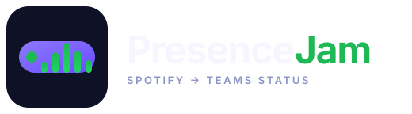
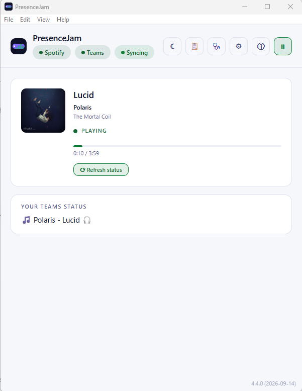
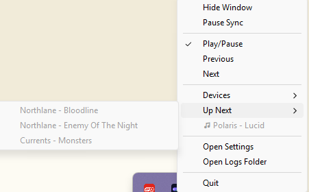
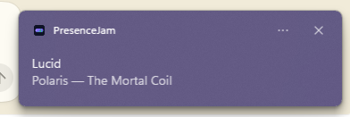
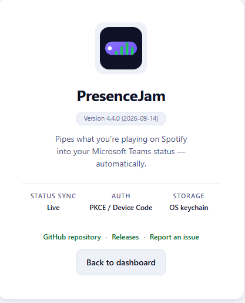

# PresenceJam



Sync what you're playing on Spotify into your Microsoft Teams status — automatically.

[](https://opensource.org/licenses/MIT)
[](https://www.rust-lang.org/)
[](https://tauri.app/)
[](https://svelte.dev/)
[](https://www.typescriptlang.org/)

## What it does

PresenceJam polls Spotify's Web API for your currently playing track and sets it as your Microsoft Teams custom status message. When the track changes, your status updates automatically. When you pause or stop, it clears your status (if you've enabled that option).

The app lives in your system tray, syncs while you work, and stays out of the way.

## Features

- **Real-time Spotify detection** — polls Spotify's Web API while a track is playing.
- **Teams status sync** — sets your Teams custom status via Microsoft Graph.
- **Smart polling** — sleeps until the track ends; ETag conditional GETs skip redundant Spotify calls.
- **Auto-clear** — clears status when Spotify pauses or stops.
- **Profanity filter** — replaces profane track names with a safe placeholder.
- **Customisable status template** — `{artist}`, `{track}`, `{album}`, `{emoji}`, `{device}`, `{playlist}` (or `{context}`), `{progress}`, `{shuffle}` and `{repeat}` placeholders, substituted in a single pass.
- **Podcasts & audiobooks** — episodes get their own `🎙️ {show} - {episode}` template instead of being reported as "nothing playing" (adverts still clear the status).
- **Light & dark themes** — pick whichever matches your desktop.
- **System tray** — runs silently in the background.
- **Tray playback controls** — Play/Pause, Previous, Next, Shuffle and Repeat toggles, plus Devices and Up Next submenus, straight from the tray icon.
- **Diagnostics page** — one-click local support snapshot (versions, sanitized config, token expiry metadata, redacted log tail). Never leaves your machine.
- **Detachable Logs & Settings** — pop Logs or Settings out into their own window and back in again.
- **Interface languages** — English, German (Deutsch), and French (Français) via an in-app language picker.
- **Availability sync (opt-in)** — optionally show yourself as **Available** in Teams while you listen, with the requested session bounded to the remaining listening time (Microsoft's `PT5M`–`PT4H` window) and cleared when you quit.
- **Meeting/call-aware gating** — skips status writes while you're busy, in a meeting, on a call, or presenting, with optionals for **out-of-office** and for never overwriting a status you set by hand. The Dashboard chip names which one fired.
- **Status rules (quiet hours & track rules)** — suppress the Teams status write during chosen hours/days or for matching tracks, post an optional replacement status, and set your Teams availability/activity while the rule applies.
- **Desktop notifications (opt-in)** — a toast on track change, throttled to one per 5 s and replaced in place where the OS supports it.
- **Auto-update** — silent update checks at startup and every ~24h; install immediately in-app, or defer with *Install on quit*, which stages the verified payload with live progress and a Cancel action and applies it as the app exits.
- **Launch at login** — optional auto-start on boot.
- **Secure auth** — Authorization Code + PKCE OAuth for Spotify (confidential client), Device Code flow for Teams.

## Screenshots


*Main dashboard — connection badges, currently playing card, and your live Teams status.*


*System tray menu — playback controls, Devices and Up Next submenus, Settings and Logs shortcuts.*


*The result in Teams — your status follows what's playing on Spotify.*


*About page — version, sync/auth/storage summary, and support links.*

## Downloads

Latest release: [GitHub Releases](https://github.com/Carme99/PresenceJam-Desktop/releases/latest). See [CHANGELOG.md](CHANGELOG.md) for the full version history.

Download the installer for your platform from the [latest release](https://github.com/Carme99/PresenceJam-Desktop/releases/latest):

- **Windows 10/11 (64-bit)** — `PresenceJam-<tag>.msi` (e.g., `PresenceJam-v4.0.0.msi`)
- **macOS (Apple Silicon)** — `PresenceJam-macos.dmg`
- **Debian / Ubuntu / Mint / popOS (64-bit)** — `PresenceJam-linux-amd64.deb`
- **Any modern Linux (64-bit, no install required)** — `PresenceJam-linux-amd64.AppImage`

<!-- canonical post-fix asset names verified via `gh release view v4.0.0` → PresenceJam-macos.dmg, PresenceJam-linux-amd64.deb, PresenceJam-linux-amd64.AppImage, PresenceJam-v4.0.0.msi (+ .msi.sig), PresenceJam-v4.0.0.app.tar.gz (+ .sig), PresenceJam-v4.0.0.AppImage.sig, SHA256SUMS.txt, latest.json -->

Filenames are canonical post-fix: `PresenceJam-macos.dmg`, `PresenceJam-linux-amd64.deb` / `PresenceJam-linux-amd64.AppImage`, `PresenceJam-<tag>.msi` — see the [latest release](https://github.com/Carme99/PresenceJam-Desktop/releases/latest) for the current version.

### Linux install

**Debian / Ubuntu / Mint / popOS** (one-time):

```bash
sudo apt install ./PresenceJam-linux-amd64.deb
# or if apt refuses the local path:
sudo dpkg -i PresenceJam-linux-amd64.deb && sudo apt-get install -f
```

**AppImage** (any distro, no install required):

```bash
chmod +x PresenceJam-linux-amd64.AppImage
./PresenceJam-linux-amd64.AppImage
```

For autostart with an AppImage, see the [Tauri Linux docs](https://v2.tauri.app/distribute/) — a `.desktop` file in `~/.local/share/applications/` plus the binary in `~/.local/bin/` is the standard pattern.

### macOS first-run note

The macOS DMG is currently **unsigned** (Apple Developer Program enrollment is not in scope — see issue #90). On first open, macOS shows "unidentified developer". To open:

- Right-click the app → **Open** (confirms once), or
- System Settings → Privacy & Security → **Open Anyway**

Subsequent opens work without the prompt.

## Quickstart

**First time?** Follow the [Setup Guide](./SETUP.md) — it covers installing the app, registering a Spotify Developer app, and connecting Teams.

**Already set up?** Just run:

```bash
# Install dependencies
npm install

# Start development mode
npm run tauri dev

# Build for release
npm run tauri build
```

## Command-line flags

PresenceJam is a tray app, but the binary also answers three **headless flags** — useful from a
script, a cron job or a support session. None of them opens the app window, and any *other*
argument is ignored, so the app starts normally exactly as it always has.

| Command | What it does |
| --- | --- |
| `presencejam --status` | Prints the sync status as **JSON on stdout** and exits `0` — the same fields the app's `get_sync_status` command returns. Builds no window and no tray icon and takes no single-instance lock, so it works headless; `spotify_connected` / `teams_connected` come from the same `config.json` and `tokens.json` the app reads. |
| `presencejam --sync-once` | Runs **exactly one poll iteration** (including the Teams status write) and exits `0` on success, or `1` with the reason on stderr. Needs a configured Spotify `client_id` and a sign-in to both Spotify and Teams; logs go to the normal log file. |
| `presencejam --help` | Prints the usage text — these three flags plus `--minimized` — and exits `0`. |
| `presencejam --minimized` | Starts with the window hidden (what the autostart plugin passes at login). This is a normal GUI launch. |

See [USAGE.md — Command-line flags](./USAGE.md#command-line-flags) for the field-by-field
details and the exact exit conditions.

## Documentation

| Doc | What it's for |
| --- | --- |
| [Setup](./SETUP.md) | Installing the app, Spotify app registration, Teams auth |
| [Usage](./USAGE.md) | Day-to-day guide — tray, dashboard, settings |
| [Architecture](./ARCHITECTURE.md) | How it works under the hood |
| [Troubleshooting](./TROUBLESHOOTING.md) | Common problems and fixes |
| [Changelog](./CHANGELOG.md) | Version history |
| [Security](./SECURITY.md) | Token storage, privacy, network |
| [Contributing](./CONTRIBUTING.md) | Dev setup, coding standards, PR process |
| [Acknowledgements](./ACKNOWLEDGEMENTS.md) | Open-source dependencies |

## Architecture

The app is built with:

- **Backend:** Tauri 2 (Rust) — polling thread, API clients, token storage, system tray
- **Frontend:** Svelte 5 + TypeScript — SPA rendered via `@sveltejs/adapter-static`
- **Storage:** `tokens.json` encrypted at rest with AES-256-GCM (decryption key in the OS keychain — DPAPI on Windows, Keychain on macOS, Secret Service on Linux), plaintext JSON for config
- **Auth:** Spotify Authorization Code + PKCE (confidential client) + Microsoft Teams Device Code flow

See [ARCHITECTURE.md](./ARCHITECTURE.md) for deep-dive diagrams and explanation.

## Status Format

Customise your Teams status using placeholders:

| Placeholder | Output |
| --- | --- |
| `{artist}` | Artist name — on an episode, the show name |
| `{track}` | Track name — on an episode, the episode name |
| `{album}` | Album name — on an episode, the publisher |
| `{emoji}` | 🎵 (playing track), 🎙️ (playing episode) or ⏸️ (paused) |
| `{device}` | Name of the device Spotify is playing on |
| `{playlist}` / `{context}` | The playlist/album/artist/show it was started from (the two tokens are exact aliases) |
| `{progress}` | Playback position (`3:07`); empty when Spotify reports none |
| `{shuffle}` / `{repeat}` | 🔀 / 🔁 while on, nothing while off |
| `{show}` / `{episode}` / `{publisher}` | Episode-only fields; empty on a music track |

**Default:** `🎵 {artist} - {track} 🎧`
**Example:** `🎵 Daft Punk - One More Time 🎧`

Substitution is a **single pass**: text that a token produced is never re-scanned, so a track literally named `{album}` is not expanded into the album name. Podcast and audiobook episodes are formatted with their own built-in `🎙️ {show} - {episode}` template, so your music template is not applied to them. See [USAGE.md — Status Format](./USAGE.md#status-format) for the live-preview details.

## License

MIT — see [LICENSE](./LICENSE) for details.
