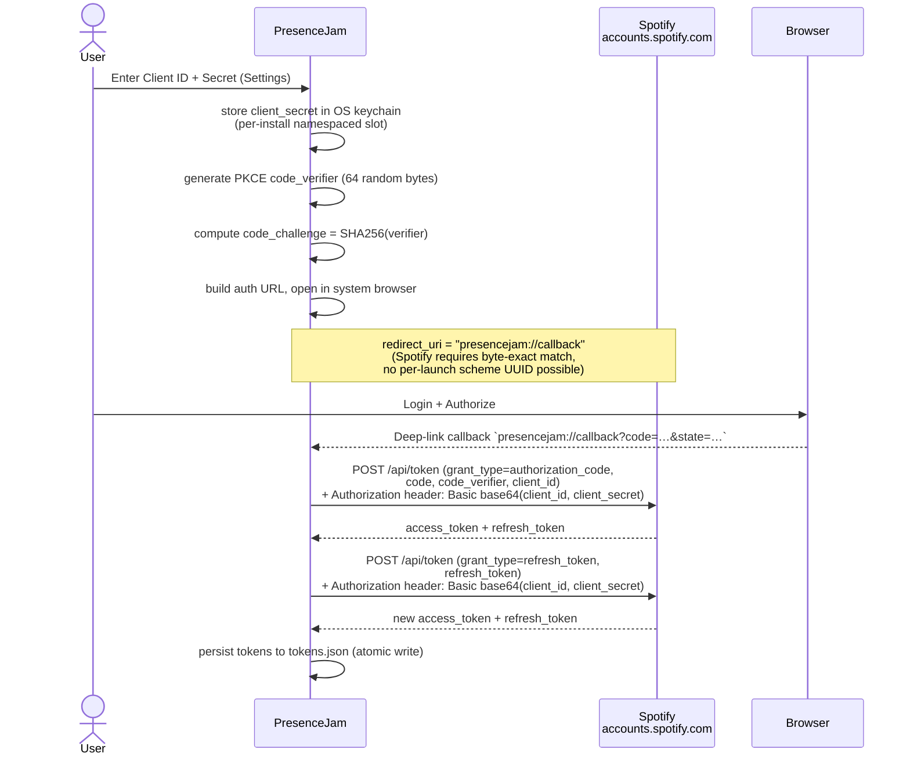
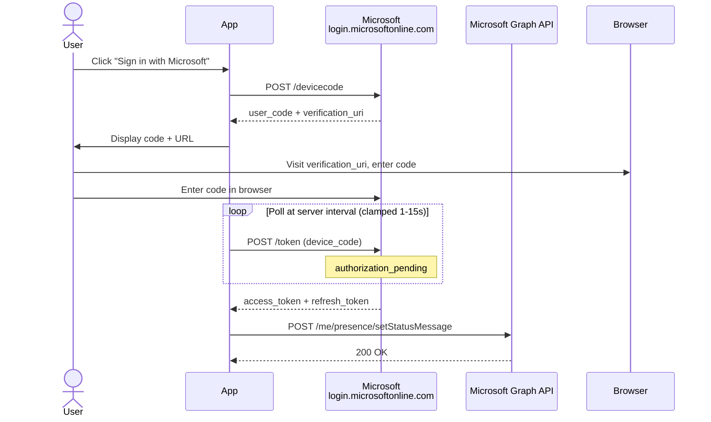

# Auth and tokens

> Spotify PKCE, the Teams device-code flow, the Graph presence calls, and the `presencejam://` deep-link routing that binds them.
>
> Part of the architecture docs — start at the [architecture index](../../ARCHITECTURE.md).

## Authentication Flows

### Spotify OAuth (Authorization Code + PKCE, confidential client)

**Notes:**

- The flow is a **hybrid**: the authorize leg is genuine PKCE (S256), and the
  token-exchange and refresh legs also authenticate with the client secret via
  `Authorization: Basic <client_id:client_secret>`. That matches neither
  Spotify flow exactly — it's the PKCE-tutorial request body plus the
  Authorization Code flow's Basic header (a strict superset of both; RFC 7636
  §5 keeps PKCE params additive, so this is a documented combination). A
  confidential client — one that can securely store a secret — is expected to
  use it (Spotify's Feb-2025 "Increasing the security requirements" post).
- The `state` parameter is the CSRF token **and** the per-launch anti-hijack
  binding — Spotify echoes it back verbatim, so we can encode extra entropy in
  it without registering anything new with Spotify. See *Deep Link Routing* for
  the matching server-side check.
- The `client_secret` round-trip from settings → keychain happens once during
  initial onboarding; subsequent token refreshes read it back from the cache.
  See `keychain.rs` and issue #9.
- The OS keychain / Secret Service write happens via `keychain.rs`; failure to
  reach a working keychain surfaces a user-actionable error pointing at
  [SETUP.md#linux-keyring](../../SETUP.md#linux-keyring).

### Microsoft Teams Device Code Flow

The app polls Microsoft's token endpoint at the server-provided device-code `interval`, clamped to 1-15s per RFC 8628 §3.5 (+5s on each `slow_down` response), while the user completes the browser auth. Once authorized, tokens are stored and the status message is set via Graph API.

#### Borrowed application identity

The device-code flow does **not** use a PresenceJam-owned Microsoft Entra app registration. `teams.rs::MICROSOFT_GRAPH_CLIENT_ID` borrows the public-client id `14d82eec-204b-4c2f-b7e8-296a70dab67e` from Microsoft's first-party **Microsoft Graph Command Line Tools** application registration. The id is not a secret, and this flow does not use a client secret or tenant credential.

That shared identity has shared consequences: Microsoft consent, attribution, policy, and service changes apply to PresenceJam and other consumers together. A user grant or revocation entry may be named Microsoft Graph Command Line Tools even when PresenceJam initiated it, and revoking that grant or the shared registration affects PresenceJam as well. When persistence succeeds, tokens issued to PresenceJam are stored in the encrypted local token store; if persistence fails, they remain only in `AppState` until restart. Runtime token-endpoint logging is bounded by `truncate_for_log`: bodies of 256 characters or fewer are logged unchanged, while longer bodies retain their first 256 Unicode scalar values plus a suffix containing the original byte count. The same helper bounds server-supplied descriptions before they are placed in user-visible sign-in failure messages. The helper does not separately redact `access_token` or `refresh_token` fields, so logs may contain those values in either an unchanged short body or a retained prefix.

The exact delegated scope set in `MICROSOFT_GRAPH_SCOPES` is `Presence.ReadWrite Presence.Read Calendars.ReadBasic MailboxSettings.Read openid profile offline_access`.

### Teams Presence APIs (v3.0)

The Graph **presence** surface (`setPresence` / `clearPresence` /
`getPresence`) is v1.0, delegated through that scope set. `Presence.ReadWrite`
powers status writes, `Presence.Read` powers the status gate, and `profile`
adds the `oid` claim used by the `/users/{oid}` fallback to the access-token
JWT. `Calendars.ReadBasic` and `MailboxSettings.Read` support the calendar
gate and working-hours import. All three endpoints hit
`graph.microsoft.com/v1.0`, and `sessionId` is always the borrowed
Microsoft Graph Command Line Tools client id (`MICROSOFT_GRAPH_CLIENT_ID`),
which must remain stable across status set and clear operations.

- **`set_teams_presence(availability, activity, expiration_duration)`** —
  `POST /me/presence/setPresence` first, falling back to
  `POST /users/{oid}/presence/setPresence` on 404 (the docs document only
  `/users/{id}`). The object id comes from the `oid` claim of the Teams
  access-token JWT (`teams.rs::graph_oid_from_access_token`), which is
  present once `profile` is in the scope string. Only five
  availability/activity combinations are valid; PresenceJam uses
  `Available`/`Available` for availability sync, and the expiration is
  derived rather than fixed — `poll_once.rs::presence_expiration_duration`
  adds one re-arm period (`AVAILABILITY_REARM_SECONDS`) to the remaining
  listening time and clamps the result into `PT5M`–`PT4H`, reserving
  `PT4H` for the unknown-position and live-stream branches (#165). See the
  presence-gating section of `polling.md` for the 240 s re-arm cadence.
- **`clear_teams_presence()`** — `POST /me/presence/clearPresence`, same
  `/users/{oid}` fallback; a 404 on either path is documented success (the
  session is already gone).
- **`get_teams_presence()`** — `GET /me/presence`, parsed
  case-insensitively into `PresenceInfo { availability, activity }`
  (the docs enumerate lowercase values; real responses are PascalCase).
  Powers the status gate (issue #3.0-P2) and availability re-arm timing.

Rate limits: getPresence 1,500 req/30 s/app/tenant; presence writes
10,000 req/30 s/app/tenant — the polling loop's cadences sit far inside
both. The entire presence surface is unsupported in the China (21Vianet)
national cloud (see `docs/STATE-OF-FEATURES.md`).

## Deep Link Routing

PresenceJam registers the custom URL scheme `presencejam://` (declared in
`tauri.conf.json` under `plugins.deep-link.desktop.schemes`) to handle OAuth
callbacks. The registration runs **on every launch**, not just at install:

| Scheme                          | Used For                          |
|---------------------------------|-----------------------------------|
| `presencejam://callback`        | Spotify OAuth redirect (Authorization Code + PKCE) |

### Routing flow

`lib.rs::handle_deep_link` parses the URL, matches on scheme + path, and
dispatches to `handle_spotify_callback` — the only deep-link consumer.
Teams auth uses the **device-code flow exclusively**, which needs no
redirect URI at all (and therefore no callback route). The single-instance
plugin scans the launch argv for `presencejam://…` on Windows + Linux so
opening a callback URL routes to the running instance (via the
single-instance hook) instead of spawning a second copy.

### `state` parameter is both CSRF and anti-hijack binding

Spotify echoes the OAuth `state` parameter back verbatim in the callback URL.
We piggyback two things on it:

1. **CSRF token** (random 64-byte verifier-ish) — rejected on mismatch
   in `handle_spotify_callback`, defending against cross-site initiated flows.
2. **Per-launch anti-hijack binding** — the matching verifier is also in
   `AppState::PendingSpotifyAuth.state` (in-memory only, never persisted —
   issue #65). An interceptor who steals the OAuth `code` cannot exchange it
   for tokens without the verifier, and our polling thread's verifier cache
   keeps the secret off disk.

### Per-launch scheme re-registration (further mitigates #66)

`tauri-plugin-deep-link`'s `register_all()` is invoked in the desktop
`setup` block on every launch. Behavior by platform:

- **Windows:** writes `HKCU\Software\Classes\presencejam` — last-writer
  wins. A foreign app that pre-registered the scheme gets clobbered.
- **Linux:** writes `~/.local/share/applications/presencejam.desktop` with
  `MimeType=x-scheme-handler/presencejam;` and runs `xdg-mime default`.
  Same last-writer semantics.
- **macOS:** the plugin's `register` returns `Err(UnsupportedPlatform)`, and the
  error arm of that call is now the load-bearing path (4.6, #66/#628). macOS
  claims a URL scheme through the app bundle's `CFBundleURLTypes`, and
  LaunchServices gives the **first** claimant priority, so the plugin call cannot
  take `presencejam://` back from an app that registered it first. The setup hook
  therefore calls `macos_deeplink::claim`, which issues
  `LSSetDefaultHandlerForURLScheme` (CoreServices, via `objc2-core-services`) —
  that writes the user's *preferred* handler and does override first-come-first-
  served registration. The scheme list is read from the same
  `tauri.conf.json` the plugin reads, so a scheme added there is re-claimed
  automatically; the call is latched to at most once per process
  (`macos_deeplink::CLAIMED`, consumed on the *attempt*). Apple marks the symbol
  deprecated as of macOS 12 — the module documents accepting it deliberately,
  because the supported replacement
  (`-[NSWorkspace setDefaultApplicationAtURL:toOpenURLsWithScheme:completionHandler:]`)
  is asynchronous and would have to be re-entered from an Objective-C block
  during startup. Failure is only logged: under `tauri dev` the process is a bare
  binary rather than a bundle, so `kLSNotAnApplicationErr` is expected, and the
  #65 PKCE launch-binding defence covers the gap either way.

On a `name` mismatch (an attacker pre-registers before launch), the
local-machine registry / desktop file reflects our (last-write) entry. All three
platforms now re-claim on every launch: Windows and Linux through the plugin's
`register_all()`, macOS through the CoreServices call above. The residual risk is
an attacker that registers **between** our launch and the callback — accepted,
and mitigated by the PKCE verifier never leaving `AppState` (#65).
