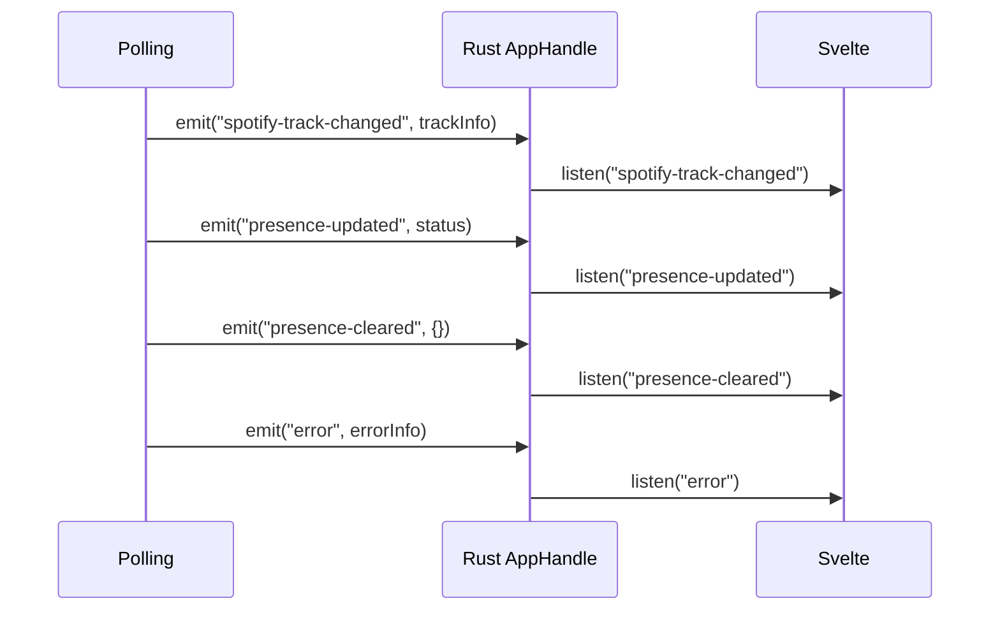

# Frontend

> The Svelte side: directory layout, in-app pages (diagnostics, log viewer), the Rust→frontend event bus and the notification throttle.
>
> Part of the architecture docs — start at the [architecture index](../../ARCHITECTURE.md).

## Local Diagnostics Page (v4.0)

`src-tauri/src/diagnostics.rs` implements `get_diagnostics_snapshot`, a support
snapshot collected **entirely locally** — the page makes no network calls,
matching SECURITY.md's No Telemetry promise. The snapshot contains:

- App / Tauri / OS version strings.
- A **sanitized** config summary (no secrets; the Spotify client secret lives in
  the keychain and never enters config).
- OAuth token **metadata only** — RFC3339 expiry timestamps + presence flags;
  never a token value.
- Keychain presence flags for both app slots (namespaced client-secret slot +
  tokens AES-key slot).
- The most recent exit-time update install that failed, if any (issue #244) —
  read from the marker `updater_bg::install_pending_on_exit` writes, so a failed
  install is visible on the next launch instead of silently lost.
- The config-quarantine state (#537, completing #379): `config_quarantined`
  (true when *this* process renamed an unreadable `config.json` aside) and
  `config_quarantine_backup`, the **bare file name** of the `.bak` when one is
  still next to the config. Without the flag, every value in the summary below
  reads as the user's own when it is really a factory default.
- The last 50 lines of the on-disk `PresenceJam.log` tail, passed through a
  defensive second-pass redaction helper (`redact_sensitive`) that reuses the `[REDACTED len N]`
  pattern from v3.2 (#228) — a keyed allowlist (`token`, `password`/`passwd`, `id_token`, `code_verifier`/`code_challenge`, `api_key`, …) with single-quote + whitespace-gap separators, plus any ≥32-char JWT/base64 opaque run, is scrubbed.

Two 4.6 hardening passes sit on top of that redaction. **Auth-scheme awareness:**
`Authorization: Bearer <token>` used to have the scheme word masked and the
credential left to the ≥32-char opaque-run heuristic, so a *short* credential was
printed in full; `is_auth_scheme_key` (`authorization`, `bearer`) plus
`skip_auth_scheme` (skips `bearer`/`basic`/`dpop`) now start the redaction at the
credential itself. **Path hygiene:** the failed-install marker's `error` string is
also run through `strip_absolute_paths`, which reduces every absolute filesystem
path — POSIX, Windows and UNC — to its bare trailing component (#409 applied to
#603). Documented gap: that path pass covers the updater marker and the
log-source *status* strings only; `recent_logs` lines get `redact_sensitive`
alone, and its opaque-character class excludes `\`, so a short Windows path
inside a log line is not scrubbed.

The command is async with `spawn_blocking` per the v3.2 main-thread-stall
convention (file IO + keychain reads). Regression tests cover the redaction
edge cases and assert injected fake token values never survive serialization of
the snapshot. The frontend (`Diagnostics.svelte`) offers Copy diagnostics /
Save to file with `role="status"` feedback, reachable from a dashboard icon
button.

## Log Viewer (v4.6)

The Logs pane is seeded from disk before the live stream takes over (#595):

- `commands/logs.rs::get_recent_logs(limit)` reads the tail inside
  `tauri::async_runtime::spawn_blocking` (the #215 convention — the UI thread
  never waits on the file). It is bounded twice: `limit` is clamped into
  `1..=MAX_LOG_LINES` (500, matching the pane's buffer) and the read itself never
  touches more than the trailing `LOG_TAIL_MAX_BYTES` (256 KiB). Seeking
  mid-file lands inside a line, so the partial first line is dropped.
- **The seed is raw, not redacted** — deliberately. The redacted tail belongs to
  the Copy-snapshot path (`diagnostics::tail_log_file`), whose artifact is pasted
  into public bug reports; this one shows the same file the user can already open
  with `open_logs_folder`, and redacting it would make the viewer disagree with
  the file it claims to display.
- A missing file is `Ok(vec![])`, not an error (first run has no log yet), and the
  pane falls back to its empty state.
- `LogViewer.svelte` registers the `log://log` listener **first**, then awaits the
  seed, so nothing logged during the read is lost; the seed is prepended and the
  array re-clamped to `MAX_BUFFER` (500), while the DOM renders only the last
  `RENDER_WINDOW` (100) entries. **Clear** sets `seedCancelled` so history cannot
  reappear a moment later.
- **Scroll anchoring (#600):** while the pane is unpinned, every push captures a
  surviving row's `offsetTop` and re-applies the delta after the DOM update, so
  the text no longer slides upward one row per event. The container sets
  `overflow-anchor: none` because Chromium's own scroll anchoring would apply the
  correction twice; WebKit has none and ignores the property.

## Event Bus

The Rust backend communicates with the Svelte frontend via Tauri events:



| Event | Payload | Triggered When |
|-------|---------|---------------|
| `spotify-track-changed` | `TrackInfo` | New track detected or track state changed |
| `presence-updated` | `{status, timestamp}` | Teams status successfully updated |
| `presence-cleared` | `{timestamp}` | Teams status cleared |
| `error` | `{source, message, severity}` | Any API error (Spotify, Teams, or auth); `severity` is `warning` or `error` |
| `spotify-reconnect-required` | `null` | Spotify token expired or auth failure requiring re-auth |
| `teams-reconnect-required` | `null` | Teams token expired or auth failure requiring re-auth |
| `reconnect-required` | `null` | Transient failure retry limit exhausted, polling loop exiting (5-strikes exit also emits provider-specific `spotify-reconnect-required` alongside, #389) |
| `polling-thread-panicked` | `null` | Polling thread panicked and was caught by `catch_unwind` |
| `tray-click` | — | User clicks tray icon |
| `toggle-pause` | — | User clicks Pause in tray menu |
| `presence-gated` | `{reason, availability, activity, timestamp}` | Status write suppressed. `reason` is one of the four rule/policy strings — `quiet-hours`, `track-rule` (v4.5.0, #432), `manual-status` (#635), `out of office` (#637, spaces) — or a presence verdict: `busy` / `Do Not Disturb` / `focusing` availability, or `in a meeting` / `in a call` / `presenting` activity (v3.0; `focusing` added in #254). The Dashboard maps the four rule/policy strings to reason-specific chip copy and falls back to the generic busy/meeting line for every presence verdict, an unknown reason and the empty reason. Six emit sites funnel through the single `emit_presence_gated` |
| `presence-availability-updated` | `{available, label, timestamp}` | Availability session armed (`Available`, or a matched rule's pair — v4.6, #634) or cleared in-session (v3.0). **Not** emitted by the exit-time cleanup |
| `playback-error` | `string` (error message) | Tray playback command failed — no active device, non-Premium 403, etc. (v3.0) |
| `spotify-auth-complete` | `null` | Spotify sign-in finished and tokens were persisted (no token value in the payload — #299) |
| `teams-auth-complete` | `null` | Teams device-code sign-in finished and tokens were persisted (no token value — #299) |
| `teams-auth-failed` | `string` (error message) | Teams device-code sign-in failed — listener is `listen<string>` |
| `spotify-auth-failed` | `string` (error message) | Spotify sign-in (deep-link callback) failed — listener is `listen<string>` |
| `sync-started` | `null` | Polling started (or resumed) |
| `sync-stopped` | `null` | Polling paused |
| `navigate` | `"dashboard"` \| `"logs"` \| `"settings"` (bare string; the listener is `listen<string>`) | A tray/menu item or a completed auth flow asks the UI to switch view (C2) |
| `open-logs-folder` | `null` | User picks "Open Logs Folder" in the tray or app menu |
| `app-shutdown` | `null` | User picks Quit in the tray or app menu |
| `spotify-secret-conflict` | `{action: "reconnect-spotify", ...}` (once per process) | Legacy plaintext secret in `config.json` conflicts with a *different* keychain secret — plaintext left untouched, Settings prompts Reconnect Spotify (#376) |
| `show-about` | `null` | User picks About in the app menu |
| `update-stage-progress` | `{downloaded, total}` (`total` null without `Content-Length`; not ts-rs-exported — mirrored in `UpdatePrompt.svelte`) | A deferred install-on-quit payload is downloading; throttled to 250 ms / 5 % with the first chunk always emitting (v4.6, #590) |

### Frontend notification throttle (C8)

`Dashboard.svelte` owns the opt-in desktop-notification path — the only
consumer of `spotify-track-changed` that raises a toast. The flag lives in
`localStorage.notificationsEnabled` (default off — **not** in `config.json`);
the Settings toggle requests OS permission on first enable. Two guards run
before `sendNotification`: the track key (`"<title>::<artist>"`,
`lastNotifiedId`) suppresses a repeat of the same track, and a 5 s
timestamp throttle (`NOTIFICATION_THROTTLE_MS`) caps the rate. A throttled
track does **not** claim `lastNotifiedId`, so once the window elapses the
genuinely current track can still notify. Toasts carry a stable `id` +
`group`, which lets platforms that support it replace the previous
notification in place instead of stacking.

## Directory Structure

```
PresenceJam-Desktop/
├── src/                                   # Svelte 5 frontend (SPA)
│   ├── lib/
│   │   ├── components/
│   │   │   ├── Dashboard.svelte            # Sync status + currently-playing card
│   │   │   ├── Onboarding.svelte           # 3-step OAuth wizard
│   │   │   ├── Settings.svelte             # Config editor
│   │   │   ├── Reconnect.svelte            # Re-auth flow
│   │   │   ├── UpdatePrompt.svelte         # Auto-update banner (check → download → relaunch, v3.0; silent 24h re-check + install-on-quit, v4.0)
│   │   │   ├── Diagnostics.svelte          # Local diagnostics snapshot viewer (v4.0)
│   │   │   ├── About.svelte                # Version + license
│   │   │   ├── Logo.svelte                 # Brand mark
│   │   │   ├── PageHeader.svelte           # Shared view header (title, back/pop-out actions)
│   │   │   └── LogViewer.svelte            # In-app log viewer (detachable to its own window, v4.0; disk backfill + scroll anchoring, v4.6)
│   │   ├── stores/
│   │   │   ├── app.ts                      # currentView, appError (classic writable stores)
│   │   │   ├── config.ts                   # configStore + saveConfig
│   │   │   ├── authFlow.svelte.ts          # 4-event auth-listener state
│   │   │   ├── detach.ts                   # logs/settings popped-out state (main-window only, v4.0)
│   │   │   ├── theme.ts                    # light/dark theme store
│   │   │   ├── presence.ts                 # Process-lifetime presence store — survives a Dashboard remount (v4.6, #547)
│   │   │   └── notifications.ts            # localStorage-backed notification opt-in + cross-window sync (v4.6, #549)
│   │   ├── types.ts                        # Re-exports ts-rs codegen
│   │   ├── types-generated/                # ts-rs output (gitignored, regenerated by cargo test)
│   │   ├── i18n.ts                         # i18n barrel — t(key, params) / reactive locale (en/de/fr, v4.0)
│   │   ├── i18n/
│   │   │   ├── en.ts                       # English dictionary + `Dict` type (source of truth for keys)
│   │   │   ├── de.ts                       # German dictionary (typed against Dict)
│   │   │   ├── fr.ts                       # French dictionary (typed against Dict)
│   │   │   └── store.svelte.ts             # locale $state store, localStorage persistence
│   │   └── utils/
│   │       ├── boot.ts                     # Launch gate → dashboard/onboarding/reconnect (bootView)
│   │       ├── dev.ts                      # devLog() no-op in prod builds
│   │       ├── reconnect.ts                # shouldAutoStartSpotifyReconnect (v4.5.2, #530)
│   │       └── useAuthListeners.ts         # Shared 4-event listener setup
│   └── routes/
│       ├── +layout.js                      # SvelteKit layout config (ssr = false)
│       ├── +layout.svelte                  # Main-window-guarded reconnect/update listeners
│       ├── +page.svelte                    # SPA entry, routes to views
│       └── detached/[pane]/+page.svelte    # Renders LogViewer/Settings in detached mode (v4.0)
├── src-tauri/
│   ├── src/
│   │   ├── lib.rs                          # Tauri entry, command registration, AppState
│   │   ├── commands/                       # Split from commands.rs (PR #76)
│   │   │   ├── mod.rs                      #   re-exports + tests
│   │   │   ├── config.rs                   #   save_config / load_config
│   │   │   ├── spotify_auth.rs             #   start_spotify_auth / reconnect / refresh
│   │   │   ├── teams_auth.rs                #   device code + refresh
│   │   │   ├── sync.rs                     #   start_syncing / stop_syncing / get_sync_status
│   │   │   ├── window.rs                    #   show_window / autostart / logs folder
│   │   │   ├── onboarding.rs                #   is_onboarding_complete / complete / reconnect
│   │   │   ├── playback.rs                 #   playback_play / pause / next / previous / transfer + devices / queue (v3.0)
│   │   │   ├── misc.rs                     #   preview_status / update_tray_menu_state / relaunch_app
│   │   │   └── logs.rs                     #   get_recent_logs — bounded on-disk tail for the Logs pane (v4.6, #595)
│   │   ├── polling/                        # Split from polling.rs (PR #72)
│   │   │   ├── mod.rs                      #   re-exports + ErrorSeverity + emit_error
│   │   │   ├── loop.rs                     #   driver (mpsc channel, ~50 lines)
│   │   │   ├── poll_once.rs                #   single source of truth for one iteration
│   │   │   └── state.rs                    #   start_polling / stop_polling + panic guard
│   │   ├── config.rs                      # AppConfig struct, ts-rs TS derive
│   │   ├── keychain.rs                    # OS keychain wrapper, secret-service Linux
│   │   ├── token_io.rs                    # Hand-rolled atomic-write for tokens.json
│   │   ├── pkce.rs                        # PKCE verifier/challenge generation
│   │   ├── profanity.rs                   # Curated profanity word list
│   │   ├── spotify.rs                      # PKCE OAuth client + Web API (ts-rs TS)
│   │   ├── teams.rs                        # Device-code + MS Graph (ts-rs TS)
│   │   ├── tray.rs                        # System tray + dedup snapshot (native CheckMenuItem Play/Pause + live tooltip, v4.0)
│   │   ├── updater_bg.rs                  # Background update checks + stage_deferred_update / PendingUpdate (v4.0)
│   │   ├── diagnostics.rs                 # Telemetry-free get_diagnostics_snapshot (v4.0)
│   │   ├── menu.rs                        # macOS / Windows app menu bar
│   │   └── macos_deeplink.rs              # CoreServices re-claim of presencejam:// on macOS (v4.6, #66/#628)
│   ├── Cargo.toml                         # Rust deps + `ts-rs = { version = "12", features = ["chrono-impl"] }`
│   ├── Cargo.lock                         # Commit-locked for reproducible builds
│   ├── tauri.conf.json                    # Window + deep-link + bundle config
│   └── capabilities/
│       ├── default.json                   # CSP, permissions, allowed APIs (+ runtime window creation for detach, v4.0)
│       └── detached.json                  # Minimal mirrored permission set for logs-detached/settings-detached (v4.0)
├── .github/workflows/
│   ├── ci.yml                             # PR-time: cargo check/clippy/test, npm check
│   └── release.yml                        # Tag-triggered: 3-OS matrix + homebrew + winget
├── homebrew/presence-jam.rb               # Homebrew tap formula template
├── package.json                           # Node deps + scripts
├── package-lock.json                       # npm lockfile (committed)
├── svelte.config.js                       # SvelteKit SPA config (adapter-static)
├── vite.config.js                         # Vite + Tauri dev server
└── jsconfig.json                          # TypeScript config
```

**ts-rs generated types** — `src/lib/types.ts` re-exports `SpotifyTokens`,
`TrackInfo`, `TeamsTokens`, `DeviceCodeResponse`, `SyncStatus`, and `AppConfig`
from `src/lib/types-generated/` (a build-time-only directory; .gitignored).
The Rust structs derive `#[ts_rs::TS]` with `#[ts(export, export_to =
"../../src/lib/types-generated/")]`. Renaming a Rust wire field produces a
TypeScript compile error in the consumer, not a runtime `undefined`.
