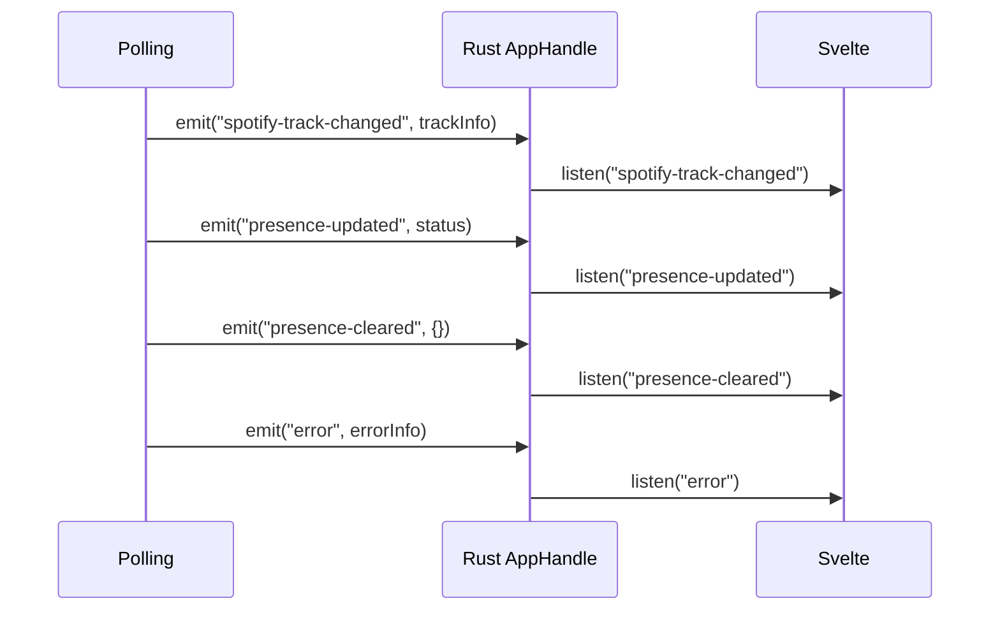

# Frontend

> The Svelte side: directory layout, in-app pages (diagnostics, log viewer), the Rust→frontend event bus and the notification throttle.
>
> Part of the architecture docs — start at the [architecture index](../../ARCHITECTURE.md).

## Local Diagnostics Page (v4.0)

`src-tauri/src/diagnostics.rs` implements `get_diagnostics_snapshot`, a support
snapshot collected **entirely locally** — the page makes no network calls,
matching SECURITY.md's No Telemetry promise. The snapshot contains:

- App / Tauri / OS version strings.
- A **sanitized** config summary (no secrets; the Spotify client secret lives in
  the keychain and never enters config).
- OAuth token **metadata only** — RFC3339 expiry timestamps + presence flags;
  never a token value.
- Keychain presence flags for the two slots exposed by the diagnostics snapshot
  (the Spotify client-secret slot and the tokens AES-key slot).
- The most recent exit-time update install that failed, if any (issue #244) —
  read from the marker `updater_bg::install_pending_on_exit` writes, so a failed
  install is visible on the next launch instead of silently lost.
- The config-quarantine state (#537, completing #379): `config_quarantined`
  (true when *this* process renamed an unreadable `config.json` aside) and
  `config_quarantine_backup`, the **bare file name** of the `.bak` when one is
  still next to the config. Without the flag, every value in the summary below
  reads as the user's own when it is really a factory default.
- The last 50 lines of the on-disk `PresenceJam.log` tail, with every line
  passed through `redact_sensitive` and then `strip_absolute_paths`; the latter
  reduces POSIX, Windows, and UNC absolute paths to their bare trailing
  component before the snapshot is exposed.

Two 4.6 hardening passes sit on top of that redaction. **Auth-scheme awareness:**
`Authorization: Bearer <token>` used to have the scheme word masked and the
credential left to the ≥32-char opaque-run heuristic, so a *short* credential was
printed in full; `is_auth_scheme_key` (`authorization`, `bearer`) plus
`skip_auth_scheme` (skips `bearer`/`basic`/`dpop`) now start the redaction at the
credential itself. **Path hygiene:** the failed-install marker's `error` string
and every collected `recent_logs` line also run through `strip_absolute_paths`,
so neither a credential nor an absolute path can reach a pasted snapshot.

`get_diagnostics_snapshot` and `save_diagnostics_snapshot` run collection,
keychain access, and filesystem work on `spawn_blocking`. The save command is
deliberately Rust-owned: the webview supplies neither JSON nor a destination. It
recollects the typed snapshot, enforces an independent 256 KiB limit, chooses
the timestamped filename, and atomically publishes the file in the platform
Downloads directory. `write_snapshot_file_at` revalidates the typed JSON and
size before creating a file, uses a 0600 sidecar on Unix, and publishes with no
replacement. The frontend (`Diagnostics.svelte`) offers Copy diagnostics / Save
to file with `role="status"` feedback; Copy uses the displayed snapshot, while
Save asks Rust for a fresh one.

## Log Viewer (v4.6)

The Logs pane is seeded from disk before the live stream takes over (#595):

- `commands/logs.rs::get_recent_logs(limit)` reads the tail inside
  `tauri::async_runtime::spawn_blocking` (the #215 convention — the UI thread
  never waits on the file). It is bounded twice: `limit` is clamped into
  `1..=MAX_LOG_LINES` (500, matching the pane's buffer) and the read itself never
  touches more than the trailing `LOG_TAIL_MAX_BYTES` (256 KiB). Seeking
  mid-file lands inside a line, so the partial first line is dropped.
- **The seed is raw, not redacted** — deliberately. The redacted tail belongs to
  the Copy-snapshot path (`diagnostics::tail_log_file`), whose artifact is pasted
  into public bug reports; this one shows the same file the user can already open
  with `open_logs_folder`, and redacting it would make the viewer disagree with
  the file it claims to display.
- A missing file is `Ok(vec![])`, not an error (first run has no log yet), and the
  pane falls back to its empty state.
- `LogViewer.svelte` registers the `log://log` listener **first**, then awaits the
  seed, so nothing logged during the read is lost; the seed is prepended and the
  array re-clamped to `MAX_BUFFER` (500), while the DOM renders only the last
  `RENDER_WINDOW` (100) entries. **Clear** sets `seedCancelled` so history cannot
  reappear a moment later.
- **Scroll anchoring (#600):** while the pane is unpinned, every push captures a
  surviving row's `offsetTop` and re-applies the delta after the DOM update, so
  the text no longer slides upward one row per event. The container sets
  `overflow-anchor: none` because Chromium's own scroll anchoring would apply the
  correction twice; WebKit has none and ignores the property.

The level-badge grid track is `max-content`, with badge typography driven by
`var(--fs-xs)`, so localized labels are neither clipped nor allowed to overlap
the message column. `tests/browser/logviewer.spec.ts` is a required Playwright
gate: it renders all five levels in en/de/fr at comfortable and compact
densities and checks actual Chromium and WebKit box geometry. This complements rather than
replaces the Vitest suite.

## Frontend test layers

Vitest owns unit, component, and coverage checks. `tests/version-contrast.test.ts`
mounts the real root page under production CSS, reads the painted
color/opacity/background from DOM and CSSOM, composites the effective
foreground, and requires the normal-size build-version label to clear 4.5:1 in
both themes. Playwright owns assertions that require a real browser layout;
`playwright.config.ts` defines Chromium and WebKit projects, and the LogViewer
keyboard/focus regression runs in both engines. PR CI and the release `verify`
job install both browser engines before running `npm run test:browser`.

`Dashboard.svelte` subscribes to `spotify-track-changed` with
`listen<TrackInfo>`, so the TypeScript event payload is the generated Rust
contract rather than an untyped object copied by hand.


## Event Bus

The Rust backend communicates with the Svelte frontend via Tauri events:



| Event | Payload | Triggered When |
|-------|---------|---------------|
| `spotify-track-changed` | `TrackInfo` | New track detected or track state changed |
| `presence-updated` | `{status, timestamp}` | Teams status successfully updated |
| `presence-cleared` | `{timestamp}` | Teams status cleared |
| `error` | `{source, message, severity}` | Any API error (Spotify, Teams, or auth); `severity` is `warning` or `error` |
| `spotify-reconnect-required` | `null` | Spotify token expired or auth failure requiring re-auth |
| `teams-reconnect-required` | `null` (the poller's dead-session emitters) or `{user_initiated: true}` from `commands/onboarding.rs::reconnect_teams` — the only user-initiated emitter | Teams token expired or auth failure requiring re-auth, **or** the user pressed Reconnect Teams in Settings. A listener must treat an **absent** field as `false` (the consumer tests `payload?.user_initiated !== true`): only the deliberate reconnect is marked, so the "session expired" notice stays quiet for the reconnect the user just asked for while every genuine dead-session emit still notifies and still opens the device-code flow (#675) |
| `reconnect-required` | `null` | Transient failure retry limit exhausted, polling loop exiting (5-strikes exit also emits provider-specific `spotify-reconnect-required` alongside, #389) |
| `polling-thread-panicked` | `null` | Polling thread panicked and was caught by `catch_unwind` |
| `tray-click` | — | User clicks tray icon |
| `toggle-pause` | — | User clicks Pause in tray menu |
| `presence-gated` | `{reason, availability, activity, timestamp}` | Status write suppressed. `reason` is one of the current rule/policy strings — `quiet-hours`, `track-rule`, `manual-status`, `calendar`, `out of office`, `presenting`, `quiet-time`, or `idle` — or a presence verdict: `busy` / `Do Not Disturb` / `focusing` availability, or `in a meeting` / `in a call` / `presenting` activity. Dashboard-specific labels exist for `quiet-hours`, `track-rule`, `manual-status`, `out of office`, `presenting`, `quiet-time`, and `idle`; `calendar`, presence verdicts, unknown reasons, and the empty reason use the generic busy/meeting line. The current emit sites share `emit_presence_gated`. |
| `presence-availability-updated` | `{available, label, timestamp}` | Availability session armed (`Available`, or a matched rule's pair — v4.6, #634) or cleared in-session (v3.0). **Not** emitted by the exit-time cleanup |
| `playback-error` | `string` (error message) | Tray playback command failed — no active device, non-Premium 403, etc. (v3.0) |
| `spotify-auth-complete` | `null` | Spotify sign-in finished and tokens were persisted (no token value in the payload — #299) |
| `teams-auth-complete` | `null` | Teams device-code sign-in finished and tokens were persisted (no token value — #299) |
| `teams-auth-failed` | `string` (error message) | Teams device-code sign-in failed — listener is `listen<string>` |
| `spotify-auth-failed` | `string` (error message) | Spotify sign-in (deep-link callback) failed — listener is `listen<string>` |
| `sync-started` | `null` | Polling started (or resumed) |
| `sync-stopped` | `{self_terminated}` | Polling stopped. `self_terminated` is `true` when the poller ended on its own (auth 5-strikes exit, closed channel — emitted from the ownership-checked thread-exit point in `polling/state.rs`) and `false` from `commands/sync.rs::stop_syncing`, the user-initiated Pause Sync. Exactly one `sync-stopped` fires per stop on **both** paths, so this field is the only way to tell them apart — **treat an absent field as `false`** (#688, #675) |
| `navigate` | `"dashboard"` \| `"logs"` \| `"settings"` (bare string; the listener is `listen<string>`) | A tray/menu item or a completed auth flow asks the UI to switch view (C2) |
| `open-logs-folder` | `null` | User picks "Open Logs Folder" in the tray or app menu |
| `app-shutdown` | `null` | User picks Quit in the tray or app menu |
| `spotify-secret-conflict` | `{action: "reconnect-spotify", ...}` (once per process) | Legacy plaintext secret in `config.json` conflicts with a *different* keychain secret — plaintext left untouched, Settings prompts Reconnect Spotify (#376) |
| `show-about` | `null` | User picks About in the app menu |
| `update-stage-progress` | `{downloaded, total, request_id}` (`total` null without `Content-Length`; not ts-rs-exported — mirrored in `UpdatePrompt.svelte`) | A deferred install-on-quit payload is downloading; throttled to 250 ms / 5 % with the first chunk always emitting. `request_id` identifies the exact stage so a cancelled or superseded download cannot overwrite the next stage's frontend position (v4.6, #590; v4.7.0, #711) |
| `update-stage-complete` | `{version, request_id}` | A deferred install-on-quit payload finished staging successfully — emitted once per successful stage, only when something was actually staged. `version` is the **staged** version, not the current one; `request_id` lets the frontend reject a completion that was cancelled or superseded (v4.7.0, #678; #711) |

### Frontend notification throttle (C8)

4.7.0 (issue #675) replaced the single opt-in with **four notification
classes**, stored in `config.json` as `AppConfig.notifications`
(`track_change`, `sync_stopped`, `auth_required`, `update_staged`, all on by
default) and toggled one per class in Settings. The pre-4.7
`localStorage.notificationsEnabled` boolean survives only as a one-time
migration source: `stores/notifications.ts::migrateLegacyNotificationPreference`
folds it into `track_change` and removes the key **after** the write lands, so
a rejected save cannot lose an opt-out.

Dispatch is split by lifetime. `Dashboard.svelte` remains the only consumer of
`spotify-track-changed` that raises a toast, and keeps its two guards: the
track key (`"<title>::<artist>"`, `lastNotifiedId`) suppresses a repeat of the
same track, and a 5 s timestamp throttle (`TRACK_NOTIFICATION_THROTTLE_MS`)
caps the rate — a throttled track does **not** claim `lastNotifiedId`, so once
the window elapses the genuinely current track can still notify. The other
three classes are dispatched from `routes/+layout.svelte`, which is always
mounted: `sync-stopped` notifies only when the poller ended on its own
(`payload?.self_terminated === true`, so a user's Pause Sync stays quiet),
`teams-reconnect-required` skips a reconnect the user just pressed
(`payload?.user_initiated !== true`), and `update-stage-complete` reports a
successfully staged install-on-quit update once. Toasts carry a stable `id` +
`group`, which lets platforms that support it replace the previous
notification in place instead of stacking.

## Directory Structure

```
PresenceJam-Desktop/
├── src/                                   # Svelte 5 frontend (SPA)
│   ├── lib/
│   │   ├── components/
│   │   │   ├── Dashboard.svelte            # Sync status + currently-playing card
│   │   │   ├── Onboarding.svelte           # 3-step OAuth wizard
│   │   │   ├── Settings.svelte             # Config editor
│   │   │   ├── Reconnect.svelte            # Re-auth flow
│   │   │   ├── UpdatePrompt.svelte         # Auto-update banner (check → download → relaunch, v3.0; silent 24h re-check + install-on-quit, v4.0)
│   │   │   ├── Diagnostics.svelte          # Local diagnostics snapshot viewer (v4.0)
│   │   │   ├── About.svelte                # Version + license
│   │   │   ├── Logo.svelte                 # Brand mark
│   │   │   ├── PageHeader.svelte           # Shared view header (title, back/pop-out actions)
│   │   │   └── LogViewer.svelte            # In-app log viewer (detachable to its own window, v4.0; disk backfill + scroll anchoring, v4.6)
│   │   ├── stores/
│   │   │   ├── app.ts                      # currentView, appError (classic writable stores)
│   │   │   ├── config.ts                   # configStore + saveConfig
│   │   │   ├── authFlow.svelte.ts          # 4-event auth-listener state
│   │   │   ├── detach.ts                   # logs/settings popped-out state (main-window only, v4.0)
│   │   │   ├── theme.ts                    # theme store (light/dark/system, v4.7) + density store
│   │   │   ├── presence.ts                 # Process-lifetime presence store — survives a Dashboard remount (v4.6, #547), seeded from `get_sync_status` (v4.7, #670)
│   │   │   └── notifications.ts            # Notification-class preferences + toasts (config-backed, v4.7); legacy localStorage migration only
│   │   ├── types.ts                        # Re-exports ts-rs codegen
│   │   ├── types-generated/                # ts-rs output (gitignored, regenerated by cargo test)
│   │   ├── i18n.ts                         # i18n barrel — t(key, params) / reactive locale (en/de/fr, v4.0)
│   │   ├── i18n/
│   │   │   ├── en.ts                       # English dictionary + `Dict` type (source of truth for keys)
│   │   │   ├── de.ts                       # German dictionary (typed against Dict)
│   │   │   ├── fr.ts                       # French dictionary (typed against Dict)
│   │   │   └── store.svelte.ts             # locale $state store — `config.locale` is the source of truth, localStorage is the pre-paint mirror (v4.7)
│   │   └── utils/
│   │       ├── boot.ts                     # Launch gate → dashboard/onboarding/reconnect (bootView)
│   │       ├── dev.ts                      # devLog() no-op in prod builds
│   │       ├── reconnect.ts                # shouldAutoStartSpotifyReconnect (v4.5.2, #530)
│   │       └── useAuthListeners.ts         # Shared 4-event listener setup
│   └── routes/
│       ├── +layout.js                      # SvelteKit layout config (ssr = false)
│       ├── +layout.svelte                  # Always-mounted listeners: presence/sync events, reconnect/update handlers, notification dispatch
│       ├── +page.svelte                    # SPA entry, routes to views
│       └── detached/[pane]/+page.svelte    # Renders LogViewer/Settings in detached mode (v4.0)
├── src-tauri/
│   ├── src/
│   │   ├── lib.rs                          # Tauri entry, command registration, AppState
│   │   ├── main.rs                         # Binary entry point — calls `presence_jam_lib::run()`
│   │   ├── commands/                       # Split from commands.rs (PR #76)
│   │   │   ├── mod.rs                      #   re-exports + tests
│   │   │   ├── config.rs                   #   save_config / load_config
│   │   │   ├── spotify_auth.rs             #   start_spotify_auth / reconnect / refresh
│   │   │   ├── teams_auth.rs                #   device code + refresh
│   │   │   ├── sync.rs                     #   start_syncing / stop_syncing / get_sync_status
│   │   │   ├── window.rs                    #   show_window / autostart / logs folder
│   │   │   ├── onboarding.rs                #   is_onboarding_complete / complete / reconnect
│   │   │   ├── playback.rs                 #   player-refresh policy + get_spotify_granted_scopes (v3.0; #770)
│   │   │   ├── misc.rs                     #   preview_status / update_tray_menu_state / relaunch_app
│   │   │   ├── logs.rs                     #   get_recent_logs — bounded on-disk tail for the Logs pane (v4.6, #595)
│   │   │   └── shortcuts.rs                #   global-hotkey registration, validation and rebinding (v4.7, #676)
│   │   ├── polling/                        # Split from polling.rs (PR #72)
│   │   │   ├── mod.rs                      #   re-exports + ErrorSeverity + emit_error
│   │   │   ├── loop.rs                     #   driver (mpsc channel, ~50 lines)
│   │   │   ├── poll_once.rs                #   single source of truth for one iteration
│   │   │   └── state.rs                    #   start_polling / stop_polling + panic guard
│   │   ├── config.rs                      # AppConfig struct, ts-rs TS derive
│   │   ├── keychain.rs                    # OS keychain wrapper, secret-service Linux
│   │   ├── token_io.rs                    # Hand-rolled atomic-write for tokens.json
│   │   ├── pkce.rs                        # PKCE verifier/challenge generation
│   │   ├── profanity.rs                   # Curated profanity word list
│   │   ├── spotify.rs                      # PKCE OAuth client + Web API (ts-rs TS)
│   │   ├── teams.rs                        # Device-code + MS Graph (ts-rs TS)
│   │   ├── tray.rs                        # System tray + dedup snapshot (native CheckMenuItem Play/Pause + live tooltip, v4.0)
│   │   ├── updater_bg.rs                  # Background update checks + stage_deferred_update / PendingUpdate (v4.0)
│   │   ├── diagnostics.rs                 # Telemetry-free get_diagnostics_snapshot (v4.0)
│   │   ├── menu.rs                        # macOS / Windows app menu bar
│   │   ├── i18n.rs                        # Rust-side UI string table for the native surfaces (v4.7, #674)
│   │   └── macos_deeplink.rs              # CoreServices re-claim of presencejam:// on macOS (v4.6, #66/#628)
│   ├── Cargo.toml                         # Rust deps + `ts-rs = { version = "12", features = ["chrono-impl"] }`
│   ├── Cargo.lock                         # Commit-locked for reproducible builds
│   ├── tauri.conf.json                    # Window + deep-link + bundle + packaged-webview CSP
│   └── capabilities/
│       ├── default.json                   # Main-window Tauri permission allowlist
│       └── detached.json                  # Minimal detached-window permission set
├── .github/workflows/
│   ├── ci.yml                             # PR-time Rust, Vitest coverage, and Playwright browser gates
│   └── release.yml                        # Tag verification + 3-OS build + package-manager publication
├── homebrew/presence-jam.rb               # Homebrew tap formula template
├── tests/                                 # Vitest suite + Chromium/WebKit browser specs under tests/browser/
├── playwright.config.ts                   # Browser test directory, Vite server, Chromium + WebKit projects
├── vitest.config.js                       # Vitest + coverage ratchet (four thresholds)
├── rust-toolchain.toml                    # pinned Rust toolchain, used by CI and local builds
├── src/app.css                            # global stylesheet: design tokens, themes, densities
├── docs/                                  # architecture, setup, release and state-of-features docs
├── package.json                           # Node deps + scripts
├── package-lock.json                       # npm lockfile (committed)
├── svelte.config.js                       # SvelteKit SPA config (adapter-static)
├── vite.config.js                         # Vite + Tauri dev server
└── jsconfig.json                          # TypeScript config
```

The tree is a curated map of entry points, not an exhaustive listing — it names the
files a contributor is most likely to need, so a new module can exist without
appearing here.

**ts-rs generated types** — `src/lib/types.ts` re-exports `SpotifyTokens`,
`TrackInfo`, `TeamsTokens`, `DeviceCodeResponse`, `SyncStatus`, and `AppConfig`
from `src/lib/types-generated/` (a build-time-only directory; .gitignored).
The Rust structs derive `#[ts_rs::TS]` with `#[ts(export, export_to =
"../../src/lib/types-generated/")]`. Renaming a Rust wire field produces a
TypeScript compile error in the consumer, not a runtime `undefined`.
