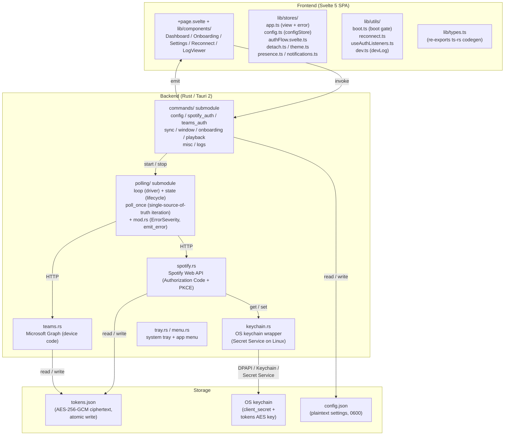
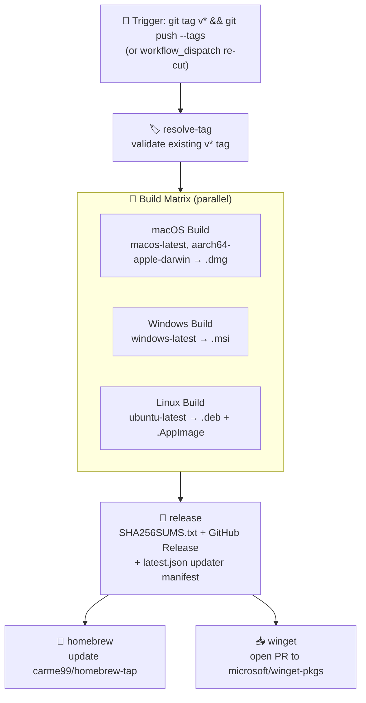

# Architecture overview

> What PresenceJam is, how the pieces fit together, and how a release is cut.
>
> Part of the architecture docs — start at the [architecture index](../../ARCHITECTURE.md).

## Overview

PresenceJam is a Tauri 2 desktop application:

- **Frontend:** Svelte 5 + TypeScript (SPA via `@sveltejs/adapter-static`),
  wired to a strict Rust contract via `ts-rs` build-time codegen (see
  *Directory Structure* in [frontend.md](frontend.md#directory-structure)).
- **Backend:** Rust — Tauri 2 `#[tauri::command]` handlers in the
  `commands/` submodule tree, plus a single `polling/` driver that
  handles all Spotify/Teams sync work.
- **Storage (atomic, no tauri-plugin-store):** all persistence goes
  through two hand-written atomic-write modules (`tauri-plugin-store` was
  fully pruned from the app and its capabilities in v4.0 — issue C13):
  - `config.rs::save_config()` → `atomic_write_json()` → temp-file + rename
    + fsync to `%APPDATA%\PresenceJam\config.json` (Linux/macOS path
    variants handled by `dirs`).
  - `token_io.rs::persist_tokens()` → temp-file + rename + fsync to
    `<app-config-dir>/PresenceJam/tokens.json` for OAuth tokens. Since
    v3.0 (issue #140) the file is **AES-256-GCM ciphertext**, never
    plaintext JSON: `b"PJENC" | version byte (0x01) | 12-byte random
    nonce | ciphertext`, with the 256-bit key held in the OS keychain
    under `tokens_aes_key:com.presencejam.app`. Plaintext files from
    ≤ v2.10.0 are migrated to ciphertext on first read. `config.json`
    stays plaintext JSON (mode 0600; it holds no credentials).
  Both paths survive process-kill mid-write (see issue #65; see `SECURITY.md`).
- **Auth:** Spotify Authorization Code + PKCE OAuth (confidential client) +
  Microsoft Teams Device Code flow.
- **Secrets — TWO PATHS, both intentional** (do not conflate):
  - **Spotify `client_secret`** is in the OS keychain, namespaced per
    installation — DPAPI on Windows, Keychain on macOS, Secret Service
    on Linux (gnome-keyring or kwallet). See [SETUP.md#linux-keyring](../../SETUP.md#linux-keyring).
    A working OS keychain is a hard dependency; there is no on-disk
    encrypted fallback (issue #9).
  - **OAuth access/refresh tokens** (Spotify + Teams) live in
    `tokens.json` written atomically by `token_io.rs` — **AES-256-GCM
    ciphertext at rest** (issue #140), decryption key in the OS keychain
    under `tokens_aes_key:com.presencejam.app`. The webview has
    no path to read them (closed issue #65).
- **Platform:** Windows + macOS + Linux. Single-instance enforcement,
  system tray, `presencejam://` deep-link scheme re-registered on every
  launch (see *Deep Link Routing*).

## System Diagram

## CI/CD Pipeline

Releases are automated via GitHub Actions on every `v*` tag push (or a
manual `workflow_dispatch` re-cut of an existing tag). A `resolve-tag` job
resolves the tag first; a three-OS `build` matrix follows; then `release`,
`homebrew`, and `winget` sequence off it:

### Release Process

1. **Tag push:** Maintainer runs `git tag vX.Y.Z && git push --tags`
   (or re-cuts an existing tag via `workflow_dispatch`).
2. **Tag resolution:** the `resolve-tag` job validates the tag exists.
3. **Parallel matrix:** macOS (`macos-latest`), Windows (`windows-latest`),
   and Linux (`ubuntu-latest`; .deb + .AppImage) builds run concurrently on
   GitHub's hosted runners. Each leg also emits a SLSA build-provenance
   attestation (`actions/attest-build-provenance`).
4. **Artifact upload:** Each OS build uploads its Tauri-bundled artifact via
   `actions/upload-artifact` (v7.0.1) and the `release` job downloads them
5. **Release + updater manifest (v3.0):** The `release` job generates
   `SHA256SUMS.txt`, creates the GitHub Release via
   `ncipollo/release-action`, then hand-assembles `latest.json` —
   per-platform URLs + minisign `.sig` contents + `pub_date` — and uploads
   it to the release (`gh release upload`). The updater's configured
   endpoint resolves it via `releases/latest/download/latest.json`.
6. **Distribution:** `homebrew` and `winget` jobs (each consuming the GitHub
   Release artifact) update the tap / open a winget-pkgs PR in parallel.

Two gates guard the tag before a single artifact is built (both added in 4.6):

- **Tag/version agreement** — the `resolve-tag` job's *Verify version consistency*
  step compares the pushed tag against all three version sources
  (`src-tauri/tauri.conf.json`, `package.json`, `src-tauri/Cargo.toml`) and fails
  the run on drift. The tag decides the version written into `latest.json`, while
  the binary self-reports the version baked in at build time, so a mismatch is a
  permanent re-offer loop: the updater keeps advertising a version the app never
  becomes, and `install_pending_on_exit` sees `staged > current` on every quit.
  `ci.yml` has the PR-time twin (`version-consistency` job) so the drift is caught
  before a tag exists to disagree with (#605).
- **Tagged-commit verification** — the `verify` job (`needs: resolve-tag`) checks
  out the resolved tag and reruns the `ci.yml` gate set (fmt, clippy, Rust tests,
  `npm run check`, frontend tests, Linux system deps). `ci.yml` only triggers on
  pull requests and pushes to `main`, so without this job the exact commit that
  produces user-facing binaries would never be tested — worst of all on a
  `workflow_dispatch` re-cut. `build:` declares `needs: [resolve-tag, verify]`, so
  a failure blocks all three OS legs without burning runner minutes (#606).

The full workflow: [`.github/workflows/release.yml`](../../.github/workflows/release.yml).
The PR-time CI that gates merges is [`.github/workflows/ci.yml`](../../.github/workflows/ci.yml).
