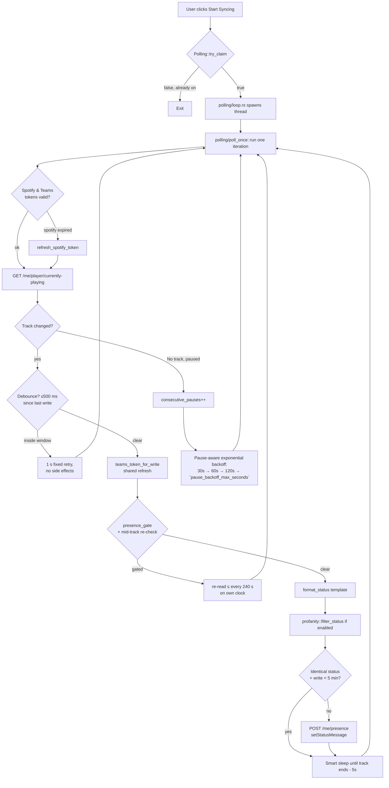

# Polling loop

> The single sync thread: intervals, failure classification, presence gating, status text and the profanity filter.
>
> Part of the architecture docs — start at the [architecture index](../../ARCHITECTURE.md).

## Polling Loop

The sync loop is intentionally a single thread, driven by `polling/loop.rs`
around the single-source-of-truth `polling/poll_once.rs` (refactored from
the pre-v2.7.5 monolith in PR #72 — three near-duplicate API-call branches
and 3 drift points now collapse into one). Flow:

One paragraph on the 4.3.0 helpers: `teams_token_for_write` is the single
shared Teams refresh (both `process_track` and `handle_no_track`);
`DEBOUNCE_RETRY_SECONDS` (1 s) parks a change inside the 500 ms window
with every tracked field untouched so the retry posts exactly once;
`STATUS_KEEPALIVE_SECONDS` (300 s) with `last_posted_status` skips
byte-identical writes but force-writes after lapse; `last_gate_check`
times mid-track gate re-checks off the write clocks; `first_iteration`
makes a fresh thread attempt one clear; `RunMode::OneShot` never parks —
`run_oneshot` discards sleeps.

### Smart sleep + pause-aware backoff (PR #45)

Two complementary rate-limits:
- **Smart sleep:** when a track is playing, sleep until `track.duration_ms - track.progress_ms - 5000ms`,
  clamped to the configured `min/max_interval_seconds`. Polling resumes
  immediately when the track changes. ~240 seconds of silence per 4-min track.
- **Pause-aware backoff:** after consecutive non-playing responses
  (`Ok(None)`, or a track with `is_playing == false`) the loop doubles its
  interval up to a 5-min cap (30 → 60 → 120 → 300 s). It resets once
  a *playing* track is observed again, and also on any tracked 304 Not
  Modified (see `not_modified_iteration`). At the 30 s default cadence a
  fully-polled day is ~2880 calls; paused, the loop settles at 1 call per
  300 s — ~288-291 calls per 24 h (steady state 288), ~72-75 per 6 h: a
  ~10× reduction, not ~28×.
- **Debounce + keepalive guards (4.3.0):** a 500 ms post-write debounce
  parks a track change on a 1 s fixed retry with no side effects
  (`DEBOUNCE_RETRY_SECONDS`); a 5-min identical-status keepalive skip
  (`STATUS_KEEPALIVE_SECONDS` + `last_posted_status`) suppresses
  byte-identical writes but force-writes after lapse so the Graph expiry
  never lapses. 304 Not Modified resets backoff via
  `not_modified_iteration`.

### Failure classification (4.6)

The loop separates **auth-classified source errors** from **network trouble**.
Only the auth path may stop the session or pop an OAuth window; network failures
increase backoff while polling continues (#568, finding PollCore#0):
- The poll loop counts `SourceError::Auth` as its auth/reconnect path. The
  Spotify source maps expired and invalid credentials there, and also maps
  `NotPremium` there; `AutoSource` tries the OS source first and consults
  Spotify only after the OS source has no track or fails.
- All non-auth source variants — including `SourceError::Unauthenticated`,
  `SourceError::Transient`, and `SourceError::Other` — feed a **separate**
  `consecutive_network_failures` counter with its own higher threshold
  (`NETWORK_FAILURE_THRESHOLD` = 12) and a capped backoff
  (`NETWORK_BACKOFF_CAP_SECONDS` = 300). It escalates the backoff and logs a
  warning; it never breaks the loop.
- `record_success` is the single place that resets both counters.

The Teams write path classifies token-endpoint `invalid_grant`, a 401
`ExpiredToken`, and `ReauthRequired` as reconnect-required. `Forbidden` is
user-action-required; rate limits, transient failures, and other errors are
warning-level retry states.

### Shared Spotify Retry-After window

A Spotify 429 with a positive, parseable `Retry-After` opens one
process-wide deadline in `spotify::RateLimitWindow`. The currently-playing
request, all player commands, device listing, and queue lookup consult that
deadline before building a request; while it is open they return
`RateLimited(Some(remaining_seconds))` without another HTTP call, and the
first call after expiry clears it. A later 429 may extend the deadline but not
shorten it. A 429 without a usable wait opens no shared window, so the poller
still applies its own network-failure backoff without blocking other callers
indefinitely.

### Presence gating + availability sync (v3.0)

Two `TeamsConfig` flags shape what the polling loop writes, and
`AppConfig::status_rules` adds a third, track- and time-based gate:

- **`presence_gate` (default ON, issue #3.0-P2):** on a *track change*
  the loop calls `get_teams_presence` *before* the status write.
  If `availability ∈ {busy, doNotDisturb, focusing}` or
  `activity ∈ {inAMeeting, inACall, presenting}` it skips the write and
  emits `presence-gated` once (the Dashboard shows a "suppressed" chip).
  While gated, the loop re-reads presence at most every 240 s on its own
  `last_gate_check` clock — never touching the debounce/keepalive write
  clocks — and posts late if the gate cleared mid-track (#380).
  Fail-safe: a failed re-read keeps the suppression. Writes proceed when
  presence is clear (`Available`, `Away`, …); a transient gate-read
  failure at change time degrades to a logged warning and the write
  proceeds.
- **`gate_when_out_of_office` (default OFF, #637):** the **lowest-precedence**
  reason, so a user who is busy or in a call still gets that more specific
  explanation. Fires on either documented signal —
  `outOfOfficeSettings.isOutOfOffice` or `activity == "outOfOffice"` (both
  case-insensitive; a body that omits the object parses as "not out of
  office"). Reason string `out of office` (spaces). A rule carrying its own
  presence pair overrides it for that iteration (`ooo_gate_enabled(config,
  rule.presence.is_some())`).
- **`respect_manual_status` (default ON, #635):** the gate also protects a
  status message the *user* typed. `manual_status_blocks_write` requires all
  five of: the flag on, a presence sample present, non-empty
  `statusMessage.message.content`, an expiry that has not lapsed, and content
  that is not byte-identical (after trim) to what this process last posted
  (`last_posted_status` / `last_posted_placeholder`). Authorship is decided by
  **content identity** — `publishedDateTime` is deliberately not modelled. No
  sample (a failed read) fails **open**: the write proceeds.
  `presence_gate_decision` applies presence reasons first, then this one, and
  returns a single reason string.

  What a gated verdict does on the playing path: record `gated_track_key`, emit
  `presence-gated`, and `return playing_track_sleep(remaining_ms, config)` —
  i.e. the **Teams write** is skipped while the loop keeps polling on its normal
  cadence and re-evaluates the gate on the re-arm clock. The paused-clear path
  honours the same verdict, so a hand-typed message is never replaced with
  "Paused".
- **`availability_sync` (default OFF, issue #3.0-P1):** while a track
  plays, re-arm the presence session via `set_teams_presence` at most every
  4 minutes — Available sessions **fade after 5 min** regardless of
  `expirationDuration`, so the re-arm cadence (`AVAILABILITY_REARM_SECONDS`
  = 240 s) stays strictly inside the fade window. Since 4.6 (#636) the
  requested `expirationDuration` is **derived**, not fixed:
  `presence_expiration_duration` takes the remaining listening time plus one
  re-arm period and clamps it into Microsoft's documented
  `PT5M`–`PT4H` window, so a crash or force-quit no longer leaves the user
  green for four hours — a live/unknown-position stream (issue #165) has no
  remaining time to bound with and keeps `PT4H`. On pause/stop,
  `clear_presence_session` drops it (404 = already gone = success).
  `RunEvent::Exit` calls `updater_bg::install_pending_on_exit` **first** and
  `polling::clear_presence_on_exit` second (the order is load-bearing: a Graph
  round-trip must never delay an install, and on Windows an update-driven quit
  exits the process without returning, so that path never reaches the
  cleanup). The clear is best-effort and log-only, bounded by
  `teams::EXIT_CLEANUP_TIMEOUT` (3 s): it no-ops when nothing of ours was armed
  or posted, skips an expired stored token, and does not emit
  `presence-availability-updated`. Emits that event on each in-session
  arm/clear.
- **`status_rules` (v4.5.0, issue #432; 4.6 semantics, #569/#570)** —
  `AppConfig::status_rules` holds quiet-hours entries and track rules. Since 4.6
  the per-iteration decision is computed **once** per poll
  (`quiet_hours_active_now` + `rule_gate`) and consulted by *every* write path,
  not just the playing one:

  | Path | Before 4.6 | 4.6 |
  |------|-----------|-----|
  | Playing track, quiet window opens mid-track | unfelt until the next track change | `quiet_gate_entry_due` evaluates the entry mid-track (#569) |
  | Already-gated track | re-checked on the #380 240 s clock | unchanged, now re-projects the local clock and re-matches the rule |
  | Paused clear | only the presence gate consulted | quiet hours and suppression rules apply to the clear too (#570) |
  | No-track clear | no rules consulted | quiet hours, plus **match-all** rules only — with no artist/title there is nothing for a scoped rule to match (#570) |

  A quiet-hours entry covering the current local time + weekday suppresses
  unconditionally (no presence read); a matching track rule with an **empty**
  `replacement_status` suppresses the same way, and one with a non-empty
  replacement supplies the status text instead of gating. Both suppression causes
  record into the same `gated_track_key` slot and emit `presence-gated` with
  `reason: "quiet-hours"` / `"track-rule"`, so the #380 mid-track re-check posts
  the status late instead of pinning suppression for the whole track. A rule with
  a non-empty replacement never gates; its text flows into the normal #384
  identical-write dedup.

  **Rule-driven presence (4.6, #634).** `rule_gate_at` returns a `RuleDecision`
  — `{ reason, replacement, presence }` — built by `decision_from`, where an
  empty replacement means *suppress* and an empty/unsupported presence pair means
  *don't touch presence* (the same normalization, repeated so an in-memory config
  that skipped the clamp cannot send Graph an unsupported pair).
  `RuleDecision::suppresses()` is `reason.is_some() && replacement.is_none()`.
  Two behaviours fall out of that shape:

  - **Precedence is quiet hours first, track rules second.** A matching
    quiet-hours row returns early; the track rule is never evaluated, so its
    replacement text and its presence pair do not apply. The two decisions are
    never merged.
  - **A suppression-only rule still moves the bubble.** `rule_presence_backoff`
    runs on the paths that return *before* the shared availability block
    (a playing write suppressed by quiet hours or a track rule) and arms the
    rule's pair — otherwise "while my Focus playlist plays, show me Do Not
    Disturb" would move nothing, since its whole point is that no status write
    happens. It is **inert unless `availability_sync` is on** (the hint text in
    the UI says the same thing).

  `should_arm_presence` arms immediately when the desired pair *differs* from the
  armed one (a rule starting or stopping must move the bubble on the next
  iteration) and otherwise keeps the 240 s cadence;
  `arm_presence_session` is the single `setPresence` call site for both the rule
  pair and the default "listening" pair, so the pair, the expiration bound and
  the cadence cannot drift apart.

`is_syncing` ownership: `commands/sync::start_syncing` is the **sole claimer**
(v2.6.3, fixes issue #60 — `compare_exchange(false, true, …)` is here).
`polling::start_polling` is a pure thread-spawner; the panic guard + spawn-error
map-err in `polling/state.rs` resets the flag so future claims don't wedge.

### User-editable config surface (4.6, #538)

Three fields that existed in `config.json` but had no UI (and, for two of them,
no reader at all) are now editable in Settings, each with inline clamp feedback
mirroring the backend bound:

| Field | Bound (backend, `config.rs`) | Settings | Consumed by |
|-------|------------------------------|----------|-------------|
| `status_rules.quiet_hours[].replacement_status` | `MAX_RULE_STATUS_CHARS` = 160 | "Post this instead (empty = suppress)" per quiet-hours row | ✅ the playing path *and* the no-track clear — a quiet-hours replacement is posted from both |
| `teams.profanity_extra_words` | `clamp_teams`: at most 64 entries, each truncated to 32 chars | "Custom words to filter", one per line | ✅ `profanity::filter_status(text, placeholder, is_playing, extra_words)` → `contains_extra_word` (built-in boundary/evasion rules, no built-in stem carve-outs) — consumed by the polling status write and by `preview_status` |
| `polling.pause_backoff_max_seconds` | `clamp_polling`: 60–3600 s | "Paused backoff ceiling (seconds)" | ✅ `poll_once::pause_backoff(consecutive, default, ceiling)` — the ladder's top rung (default 300 s; floored at the base interval so it cannot invert the ladder) |

> All three are persisted, clamped, validated **and consumed**, and the Settings
> hints describe implemented behaviour: `settings.extraWordsHint` (the words run
> through the built-in boundary and evasion rules) and
> `settings.pauseBackoffClampHint` (the ceiling is the ladder's top rung) are
> both true on `main`. The matching implementation is covered by the profiling
> tests in `profanity.rs` and the pause-ladder tests in `poll_once.rs`.

### Profanity filter

`profanity.rs` screens the formatted status string before it hits Microsoft
Graph. If matched, the status is replaced with `config.teams.profanity_placeholder`
(default: `Currently Listening to Spotify`), with the `{emoji}` placeholder
resolved to 🎵 or ⏸️. The replaced status is logged at info level; the
**original profane text is never written to logs**.

Detection features (v4.1.1, #328–#344; `src-tauri/src/profanity.rs` is the source of truth — curated word list plus compounds like `asshole`/`bullshit`/`sonofabitch` (#411)):
- **Extended leetspeak normalization:** `1/2→i, 3→e, $→s, @→a, 0→o, 5→s, 7→t, !→i, |→i, 6/8→b, 9→g, +→t, (→c, 4→a`, plus `/→v` folding, `ph→f` pre-fold, `x→ck` expansion, dropped-`c` `uk→uck` (scoped to `u`), terminal `z→s` (#377/#470), fullwidth→ASCII and a diacritic table; zero-width/format characters stripped.
- **Separator skipping gated on word boundaries** (plus glued-compound detection: `bullshit`, `dickhead`, `sonofabitch` still flag).
- **Unicode folding** (fullwidth→ASCII, diacritic table, zero-width/format strip).
- **Repeated-character collapse:** generic run-collapse (`shiiit → shit` regardless of excess length).
- **Rescan of the placeholder** (case-insensitive `{emoji}`): a profane placeholder falls back to the default (`Currently Listening to Spotify`).
- **Word-boundary safety:** prevents false positives on `class`, `assassin`, `cocktail bar`, `cockpit`, `Spice Girls`, `Push It`.
- **Compound-word safe-suffixes:** `tail, head, hand, ...` allow `fishtail`, `forehead`, `handheld`.
- **Strong stems + y-tail:** `shit/fuck/bitch` flag glued compounds; `shitty/bitchy/fucky` flag while `cocky/spicy/tardy` stay clean.

### Status formatting (4.6)

One pure function renders every status string:
`spotify::format_status_with_context(media, episode, context, format)`. The
runtime caller is `polling::poll_once::process_track`; the Settings/Onboarding
preview goes through the two-argument `format_status` /
`preview_status_with_sample`, which always passes `episode = None` and
`PlaybackContext::sample()` (device *Kitchen speaker*, playlist *Workout Mix*,
shuffle on, repeat *context*) so the mode tokens preview as something other than
holes (#74, #580).

- **Token table:** `placeholder_values` builds one 13-entry `(&str, &str)` table
  per render — `emoji`, `artist`, `track`, `album`, `device`, `playlist`,
  `context` (a literal alias of `playlist`), `progress`, `shuffle`, `repeat`,
  `show`, `episode`, `publisher`. There is no `{title}`, `{name}`, `{duration}`
  or `{type}` token.
- **Single pass:** `substitute_placeholders` walks the *format string* once,
  emitting matched values into an output buffer it never re-scans. That makes the
  "#341" rule true for every token instead of just `{emoji}` — a track literally
  titled `{album}` is no longer re-expanded by the later `{album}` pass. Unknown
  placeholders and an unterminated `{` are copied verbatim.
- **Emoji precedence:** `(false, _) => "⏸️"` comes first, then
  `(true, true) => "🎙️"`, then `(true, false) => "🎵"` — so a *paused* episode
  shows the pause glyph, not the mic.
- **`{progress}`:** `format_progress` renders `format!("{}:{:02}", secs/60, secs%60)`
  — minutes unpadded, **no hour rollover** (a 90-minute episode reads `90:00`),
  and an empty string when Spotify reported no position (live/unknown streams,
  #165). The value is the raw poll `progress_ms`; the elapsed-corrected value the
  sleep math uses is not what gets rendered.
- **Mode tokens are icon-only:** `{shuffle}` → 🔀 / `""`, `{repeat}` → 🔁 / `""`.
  The status does **not** distinguish repeat *context* from repeat *track* — both
  render 🔁; the three-valued mode matters only to the tray.
- **Episodes (#581):** `map_media_item` reads the item's own `type` against the
  documented `oneOf(track, episode)` union. An episode's `show.name` takes the
  `artist` slot and `show.publisher` the `album` slot, so the Dashboard, the
  desktop notification and the tray keep rendering one shape; `EpisodeInfo`
  carries `show_name` + `publisher`, and the `Option` itself is the episode
  marker (there is no `is_episode` field). `{show}`/`{episode}`/`{publisher}`
  render empty on a music track, so a template mentioning one never prints the
  track title by accident.
- **Adverts are still nothing playing:** the envelope's `currently_playing_type`
  is gated before the item is even mapped, and `Ad | Unknown` returns `None` from
  `map_media_item` — "nothing playing", exactly as the pre-#581 gate did. The
  queue mapper (`filter_map`) drops ads from Up Next the same way.
- **Episode template:** `poll_once::process_track` selects
  `spotify::DEFAULT_EPISODE_STATUS_FORMAT` (`🎙️ {show} - {episode}`) whenever
  `now.episode.is_some()`, and the user's `teams.status_format` otherwise, so a
  music template is never applied verbatim to a 90-minute podcast. **There is no
  `teams.episode_status_format` config key** — the constant *is* the template, and
  the Settings page renders a fixed hint saying so. Adding the key is the
  documented follow-up in the source comments.
