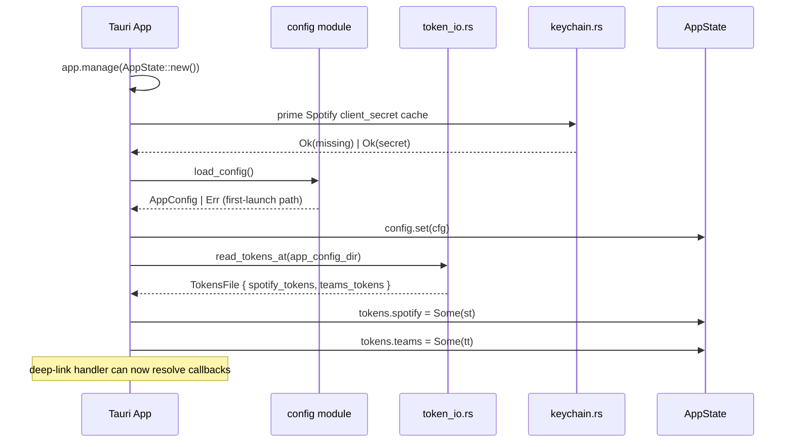
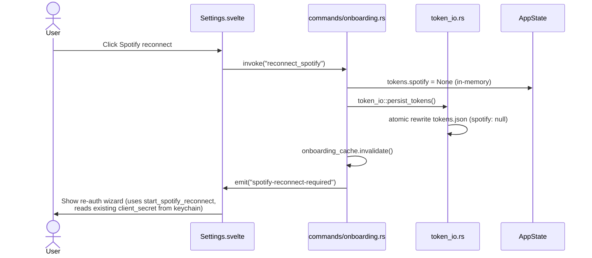

# Storage and config

> Where `config.json` and `tokens.json` live, how they are written atomically, the config-integrity layers, startup loading, reconnect, and process state.
>
> Part of the architecture docs — start at the [architecture index](../../ARCHITECTURE.md).

## Config integrity (v4.6)

Three layers keep a damaged or partial `config.json` from destroying working
settings:

- **Field-level patch merge (#535):** `config::apply_patch` overwrites only the
  fields a `ConfigPatch` explicitly names; everything else — including `extra` and
  the binary-owned `schema_version` — is left exactly as it was. Named lists are
  replaced wholesale, not merged. `update_config` uses this; `save_config` is
  still a whole-document replace, which is why the patch API exists.
- **Wizard merge (#531/#542):** the onboarding wizard is reachable by returning
  users (Dashboard's setup link, Settings' *Run onboarding*, Reconnect), so
  `mergeWizardConfig` clones the **stored** config and writes only the four fields
  the wizard owns — `spotify.client_id`, `teams.status_format`,
  `polling.default_interval_seconds` and `autostart` — then sends the result over
  `save_config`. `status_rules`, `logging`, `profanity_*`, `presence_gate`,
  `availability_sync` and `extra` survive verbatim. The read is a deliberate
  `invoke('load_config')` rather than the store helper, because the helper
  swallows a failure into `defaultConfig` and would reintroduce exactly that
  clobber; a failed read aborts the save instead of inventing a base.
- **Corrupt-file quarantine (#379):** a `config.json` that fails
  `serde_json::from_str` is renamed beside itself to `config.json.bak` (fixed
  name, never timestamped), a `[CFG] corrupt config … quarantined to …` warning is
  logged, `CONFIG_QUARANTINED` is raised, and the app boots on
  `AppConfig::default()`. The rename is best-effort: a failure is logged and
  swallowed, and the flag is raised either way, so the original file is never
  truncated. A *schema-version* mismatch is **not** a quarantine — it goes through
  `migrate_config` in place.

  > **Surfaced on the Diagnostics page (#537, completing #379):**
  > `ConfigSummary` carries `config_quarantined` and
  > `config_quarantine_backup`, injected at the command boundary from
  > `ConfigQuarantine::observe` so `build_snapshot` stays drivable from a test
  > with a planted quarantine (the same shape as the #603 failed-install
  > marker). `Diagnostics.svelte` renders a dismissible amber **Settings were
  > reset** banner from *either* fact: the per-process flag alone would vanish
  > on the first restart — exactly when the user notices their settings are
  > gone — while the `.bak` on disk outlives the launch that produced it. The
  > backup never travels as a path (`quarantine_backup_field` reduces any
  > incoming value to its last component and drops a relative path, holding the
  > #409 rule at the snapshot boundary), and the banner's location copy names
  > the PresenceJam folder rather than an absolute path. Dismiss is
  > session-local and invokes nothing: unlike the disposable failed-install
  > record, the backup is the only copy of the settings the user lost, so no UI
  > action may delete it.

The **keychain tri-state** is the other half of 4.6's honesty pass (#560/#561):
`keychain::KeychainPresence` splits `Present` / `Absent` / `Unavailable(help)`,
where `NoEntry` is the *only* error that means "never configured" and every other
`keyring::Error` (Linux `PlatformFailure`/`NoStorageAccess`: no Secret Service
daemon, locked keyring, denied access) is a recoverable platform problem. It is
carried over IPC as `ClientSecretState` (`present`/`absent`/`unavailable`,
lowercase on the wire) stamped onto the config by `with_keychain_flags`, and the
boot gate mirrors its own probe back into the in-memory config so a later save
cannot return a stale state. An *unavailable* keychain maps to
`RefreshFailure::Transient` — the session is kept and retried, exactly like a
flaky network — while only `Absent` justifies sending the user to setup.

## Startup Loading

On app launch, PresenceJam loads persisted config and tokens into `AppState`:



This means:
- **First launch:** no tokens on disk, onboarding prompts are shown.
- **Subsequent launches:** tokens atomically re-read by `token_io.rs`, OAuth-tokens
  never re-enter `tauri-plugin-store` (issue #65 closed that path).
- **After a Spotify mid-OAuth crash:** pending auth *state* is no longer persisted to disk at all — the user restarts the OAuth flow. Crash-safe: PKCE verifier (a 10-min bearer credential) is in AppState only.
- **Reconnect** clears tokens from both memory and the tokens.json file on disk, forcing re-auth.
- **Boot gate (issue #530):** `commands::onboarding::is_onboarding_complete` is
  the routing decision behind `dashboard` vs `onboarding`. A locally-expired
  access token is **not** a dead session: the gate spends the refresh token
  under the shared CAS guard, persists the result, and only reports re-auth for
  `invalid_grant` (or unavailable Spotify credentials). An incomplete verdict
  with the Spotify Client ID + keychain secret still stored routes to the
  **Reconnect** view rather than the setup wizard
  (`src/lib/utils/boot.ts::bootView`) — a returning user is never asked to
  re-enter credentials the app already holds.

## Reconnect Flow

When the user clicks "Reconnect" in Settings, the app clears auth state for
one provider and triggers re-authentication:



### Commands

| Command | Action |
|---------|--------|
| `reconnect_spotify` | Clears Spotify tokens (in-memory + atomic rewrite of tokens.json), emits `spotify-reconnect-required` event |
| `reconnect_teams` | Clears Teams tokens (in-memory + atomic rewrite of tokens.json), emits `teams-reconnect-required` event |

## State Management

### Rust State — `AppState` (struct-of-states, v2.7.5 refactor PR #80)

`AppState` is composed of private sub-structs, each with its own lock
acquired only via a method. Field access is encapsulated; the inner mutex
/atomic is **never named at call sites**:

```rust
pub struct AppState {
    pub tokens: Tokens,                       // #80 step 2: spotify + teams RwLocks
    pub polling: Polling,                     // #80 step 2: is_syncing + handle + stop_tx
    pub pending: PendingAuths,                // #80 step 2: spotify + teams RwLocks
    pub config: Config,                       // #80 step 2: AppConfig RwLock
    pub onboarding_cache: OnboardingCache,    // #80 step 1: 30s cache sub-struct
}
```

Each sub-struct exposes only lock-acquisition methods (`tokens.spotify_mut()`,
`polling.try_claim()`, `pending.spotify_mut()`, `config.set()`, `onboarding_cache.lock()`).
The lock-encapsulation pattern is what makes future work like "lock must not be
held across await" enforceable: a `lock_async` method could replace `lock` later
without rewriting every call site.

**Lock ordering / concurrency rules:**

- `is_syncing` is owned only by `commands/sync::start_syncing::try_claim()`. The
  polling `loop` reads it under `Ordering::Acquire` and exits on `false`. The
  panic guard + spawn-error `map_err` in `polling/state.rs` **reset** it so
  future claims never wedge. Adding a second CAS to `is_syncing` from anywhere
  else (PR #60 was exactly this) will brick first-run onboarding. The
  `test_app_state_sub_encapsulation_no_pub_inner_fields` regression guard
  asserts no future contributor re-exposes a sub-struct's inner mutex as `pub`.
- **Token-refresh concurrency (PR #43):** all token-refresh paths (Spotify
  proactive, Spotify 401-retry, Teams refresh) share a CAS guard: re-read
  under the write lock, only commit if `access_token` is unchanged from
  the pre-refresh snapshot, otherwise discard. Prevents the lost-update race.
- **`onboarding_cache.lock()` (PR #47):** `parking_lot::Mutex<(Instant, bool)>`
  with a 30 s TTL — `is_onboarding_complete` calls upstream APIs only on cache
  miss. Plus `invalidate()` from every token-mutating command (issue #70). Its
  boot-time refresh shares the CAS guard above (issue #530).

### Frontend state

- `lib/stores/app.ts` (classic Svelte stores): `currentView`, `appError`. Pattern: `writable<View>('dashboard')`. Not Svelte 5 runes.
- `lib/stores/config.ts`: `configStore` (full AppConfig), `saveConfig` (mirrors
  `commands/save_config`'s atomic-write semantics on the Rust side; the
  frontend does not call `localStorage`).
- `lib/stores/authFlow.svelte.ts`: per-provider `phase` (`'idle' | 'waiting'`
  `| 'error' | 'done'`) plus `error` message, updated from the 4 backend auth
  events by `setSpotifyPhase` / `setTeamsPhase` (refactored from 3 duplicated
  listener setups in PR #73 via `useAuthListeners`).
- `lib/types.ts` / `lib/types-generated/` — Rust-side TS mirrors, see *ts-rs
  generated types* in [frontend.md](frontend.md#directory-structure).
